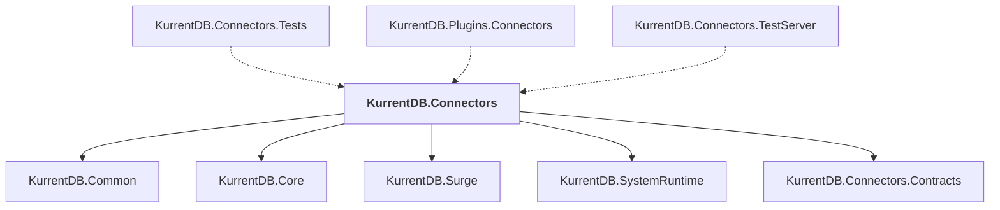

# KurrentDB.Connectors

## Overview

| Property | Value |
|----------|-------|
| Category | Connector |
| Repository | src |
| Path | `Connectors/KurrentDB.Connectors/KurrentDB.Connectors.csproj` |
| Project References | 5 |
| NuGet Dependencies | 32 |
| Consumers | 3 |

## Dependency Diagram

## Project References
- KurrentDB.Common
- KurrentDB.Core
- KurrentDB.Surge
- KurrentDB.SystemRuntime
- KurrentDB.Connectors.Contracts

## Consumed By
- KurrentDB.Connectors.Tests
- KurrentDB.Plugins.Connectors
- KurrentDB.Connectors.TestServer

## External NuGet Packages
| Package | Version |
|---------|---------||
| Google.Api.CommonProtos |  |
| Kurrent.Surge |  |
| Kurrent.Surge.Core |  |
| Kurrent.Surge.DataProtection |  |
| Kurrent.Connectors.Elasticsearch |  |
| Kurrent.Connectors.Http |  |
| Kurrent.Connectors.Kafka |  |
| Kurrent.Connectors.MongoDB |  |
| Kurrent.Connectors.RabbitMQ |  |
| Kurrent.Connectors.Pulsar |  |
| Kurrent.Connectors.Sql |  |
| Eventuous.Application |  |
| Eventuous.Extensions.AspNetCore |  |
| Eventuous.Extensions.DependencyInjection |  |
| FluentValidation.DependencyInjectionExtensions |  |
| Grpc.StatusProto |  |
| Microsoft.AspNetCore.Grpc.JsonTranscoding |  |
| Serilog |  |
| Serilog.Enrichers.Process |  |
| Serilog.Enrichers.Thread |  |
| Serilog.Expressions |  |
| Serilog.Extensions.Logging |  |
| Serilog.Settings.Configuration |  |
| Serilog.Sinks.Async |  |
| Serilog.Sinks.File |  |
| Serilog.Sinks.Console |  |
| Serilog.Formatting.Compact |  |
| Serilog.Settings.Reloader |  |
| Serilog.Sinks.Debug |  |
| Serilog.Sinks.Seq |  |
| Serilog.Enrichers.Environment |  |
| System.Linq.Async |  |

---

*[Back to Index](../index.md)*
