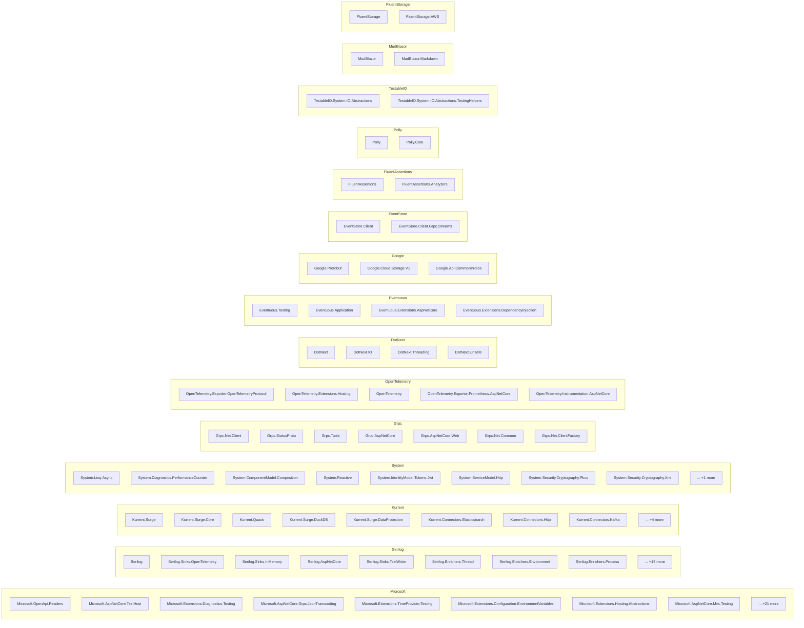

# Dependency Map

## Overview

| Metric | Count |
|--------|-------|
| Repositories | 1 |
| Total Projects | 84 |
| NuGet Packages | 146 |
| Project References | 142 |
| Data Access Findings | 1618 |
| Config Files | 6 |

## Project Categories

| Category | Count |
|----------|-------|
| Test | 40 |
| Library | 28 |
| Application | 8 |
| WebApp | 4 |
| Connector | 3 |
| Tool | 1 |

## Full Landscape

```mermaid
graph LR
    subgraph Tests
        src_KurrentDB_Core_Tests["KurrentDB.Core.Tests"]
        src_FakePlugin["FakePlugin"]
        src_KurrentDB_Core_Testing["KurrentDB.Core.Testing"]
        src_KurrentDB_Plugins_Tests["KurrentDB.Plugins.Tests"]
        src_KurrentDB_Licensing_Tests["KurrentDB.Licensing.Tests"]
        src_KurrentDB_Auth_UserCertificates_Tests["KurrentDB.Auth.UserCertificates.Tests"]
        src_KurrentDB_Auth_Ldaps_Tests["KurrentDB.Auth.Ldaps.Tests"]
        src_KurrentDB_Api_V2_Tests["KurrentDB.Api.V2.Tests"]
        src_KurrentDB_Auth_LegacyAuthorizationWithStreamAuthorizationDisabled_Tests["KurrentDB.Auth.LegacyAuthorizationWithStreamAuthorizationDisabled.Tests"]
        src_KurrentDB_Projections_Core_Tests["KurrentDB.Projections.Core.Tests"]
        src_KurrentDB_Surge_Testing["KurrentDB.Surge.Testing"]
        src_KurrentDB_Common_Tests["KurrentDB.Common.Tests"]
        src_KurrentDB_Security_EncryptionAtRest_Tests["KurrentDB.Security.EncryptionAtRest.Tests"]
        src_KurrentDB_Core_Testing_NUnit["KurrentDB.Core.Testing.NUnit"]
        src_KurrentDB_Projections_Core_XUnit_Tests["KurrentDB.Projections.Core.XUnit.Tests"]
        src_KurrentDB_Auth_StreamPolicyPlugin_Tests["KurrentDB.Auth.StreamPolicyPlugin.Tests"]
        src_KurrentDB_Surge_Testing_Messages["KurrentDB.Surge.Testing.Messages"]
        src_KurrentDB_Core_Testing_XUnit["KurrentDB.Core.Testing.XUnit"]
        src_KurrentDB_SystemRuntime_Tests["KurrentDB.SystemRuntime.Tests"]
        src_KurrentDB_AutoScavenge_Tests["KurrentDB.AutoScavenge.Tests"]
        src_KurrentDB_Projections_Core_Javascript_Tests["KurrentDB.Projections.Core.Javascript.Tests"]
        src_KurrentDB_SchemaRegistry_Tests["KurrentDB.SchemaRegistry.Tests"]
        src_KurrentDB_SecondaryIndexing_LoadTesting["KurrentDB.SecondaryIndexing.LoadTesting"]
        src_KurrentDB_Plugins_TestHelpers["KurrentDB.Plugins.TestHelpers"]
        src_KurrentDB_BufferManagement_Tests["KurrentDB.BufferManagement.Tests"]
        src_KurrentDB_Diagnostics_LogsEndpointPlugin_Tests["KurrentDB.Diagnostics.LogsEndpointPlugin.Tests"]
        src_KurrentDB_LogV3_Tests["KurrentDB.LogV3.Tests"]
        src_KurrentDB_SourceGenerators_Tests["KurrentDB.SourceGenerators.Tests"]
        src_KurrentDB_TestClient["KurrentDB.TestClient"]
        src_KurrentDB_Core_XUnit_Tests["KurrentDB.Core.XUnit.Tests"]
        src_KurrentDB_Auth_OAuth_Tests["KurrentDB.Auth.OAuth.Tests"]
        src_KurrentDB_Surge_Tests["KurrentDB.Surge.Tests"]
        src_KurrentDB_Core_TUnit_Tests["KurrentDB.Core.TUnit.Tests"]
        src_KurrentDB_Testing_ClusterVNodeApp["KurrentDB.Testing.ClusterVNodeApp"]
        src_KurrentDB_SecondaryIndexing_Tests["KurrentDB.SecondaryIndexing.Tests"]
        src_KurrentDB_Connectors_Tests["KurrentDB.Connectors.Tests"]
        src_KurrentDB_Connectors_TestServer["KurrentDB.Connectors.TestServer"]
        src_KurrentDB_Testing["KurrentDB.Testing"]
        src_KurrentDB_OtlpExporterPlugin_Tests["KurrentDB.OtlpExporterPlugin.Tests"]
        src_KurrentDB_TcpPlugin_Tests["KurrentDB.TcpPlugin.Tests"]
    end
    subgraph Librarys
        src_KurrentDB_OtlpExporterPlugin["KurrentDB.OtlpExporterPlugin"]
        src_KurrentDB_SystemRuntime["KurrentDB.SystemRuntime"]
        src_KurrentDB_Auth_StreamPolicyPlugin["KurrentDB.Auth.StreamPolicyPlugin"]
        src_KurrentDB_Native["KurrentDB.Native"]
        src_KurrentDB_LogCommon["KurrentDB.LogCommon"]
        src_KurrentDB_LogV3["KurrentDB.LogV3"]
        src_KurrentDB_Surge["KurrentDB.Surge"]
        src_KurrentDB_Transport_Http["KurrentDB.Transport.Http"]
        src_KurrentDB_NETCore_Compatibility["KurrentDB.NETCore.Compatibility"]
        src_KurrentDB_Projections_Core["KurrentDB.Projections.Core"]
        src_KurrentDB_POC_ConnectedSubsystemsPlugin["KurrentDB.POC.ConnectedSubsystemsPlugin"]
        src_KurrentDB_Licensing["KurrentDB.Licensing"]
        src_KurrentDB_AutoScavenge["KurrentDB.AutoScavenge"]
        src_KurrentDB_Common["KurrentDB.Common"]
        src_KurrentDB_Ammeter["KurrentDB.Ammeter"]
        src_KurrentDB_SchemaRegistry["KurrentDB.SchemaRegistry"]
        src_KurrentDB_SchemaRegistry_Protocol["KurrentDB.SchemaRegistry.Protocol"]
        src_KurrentDB_DuckDB["KurrentDB.DuckDB"]
        src_KurrentDB_Logging["KurrentDB.Logging"]
        src_KurrentDB_Transport_Tcp["KurrentDB.Transport.Tcp"]
        src_KurrentDB_SecondaryIndexing["KurrentDB.SecondaryIndexing"]
        src_KurrentDB_PluginHosting["KurrentDB.PluginHosting"]
        src_KurrentDB_UI["KurrentDB.UI"]
        src_KurrentDB_Core["KurrentDB.Core"]
        src_KurrentDB_POC_IO_Core["KurrentDB.POC.IO.Core"]
        src_KurrentDB_TcpPlugin["KurrentDB.TcpPlugin"]
        src_KurrentDB_BufferManagement["KurrentDB.BufferManagement"]
        src_KurrentDB_Plugins["KurrentDB.Plugins"]
    end
    subgraph Webapps
        src_KurrentDB_Plugins_Api_V2["KurrentDB.Plugins.Api.V2"]
        src_KurrentDB_Api_V2["KurrentDB.Api.V2"]
        src_KurrentDB_ClusterNode_Web["KurrentDB.ClusterNode.Web"]
        src_KurrentDB["KurrentDB"]
    end
    subgraph Applications
        src_KurrentDB_Diagnostics_LogsEndpointPlugin["KurrentDB.Diagnostics.LogsEndpointPlugin"]
        src_KurrentDB_Security_EncryptionAtRest["KurrentDB.Security.EncryptionAtRest"]
        src_KurrentDB_Auth_OAuth["KurrentDB.Auth.OAuth"]
        src_KurrentDB_MicroBenchmarks["KurrentDB.MicroBenchmarks"]
        src_KurrentDB_Plugins_SchemaRegistry["KurrentDB.Plugins.SchemaRegistry"]
        src_KurrentDB_Auth_Ldaps["KurrentDB.Auth.Ldaps"]
        src_KurrentDB_Auth_LegacyAuthorizationWithStreamAuthorizationDisabled["KurrentDB.Auth.LegacyAuthorizationWithStreamAuthorizationDisabled"]
        src_KurrentDB_Auth_UserCertificates["KurrentDB.Auth.UserCertificates"]
    end
    subgraph Tools
        src_KurrentDB_SourceGenerators["KurrentDB.SourceGenerators"]
    end
    subgraph Connectors
        src_KurrentDB_Connectors_Contracts["KurrentDB.Connectors.Contracts"]
        src_KurrentDB_Plugins_Connectors["KurrentDB.Plugins.Connectors"]
        src_KurrentDB_Connectors["KurrentDB.Connectors"]
    end
    src_KurrentDB_Core_Tests --> src_KurrentDB_Core_Testing_NUnit
    src_KurrentDB_OtlpExporterPlugin --> src_KurrentDB_Logging
    src_KurrentDB_Core_Testing --> src_KurrentDB_Core
    src_KurrentDB_Core_Testing --> src_KurrentDB_PluginHosting
    src_KurrentDB_Plugins_Api_V2 --> src_KurrentDB_Api_V2
    src_KurrentDB_Plugins_Tests --> src_KurrentDB_Plugins
    src_KurrentDB_Licensing_Tests --> src_KurrentDB_Core
    src_KurrentDB_Licensing_Tests --> src_KurrentDB_Licensing
    src_KurrentDB_Auth_UserCertificates_Tests --> src_KurrentDB_Auth_UserCertificates
    src_KurrentDB_Auth_UserCertificates_Tests --> src_KurrentDB_Common
    src_KurrentDB_Auth_Ldaps_Tests --> src_KurrentDB_Auth_Ldaps
    src_KurrentDB_Api_V2_Tests --> src_KurrentDB_Testing_ClusterVNodeApp
    src_KurrentDB_Api_V2_Tests --> src_KurrentDB_Testing
    src_KurrentDB_Api_V2_Tests --> src_KurrentDB_Api_V2
    src_KurrentDB_Auth_LegacyAuthorizationWithStreamAuthorizationDisabled_Tests --> src_KurrentDB_Auth_LegacyAuthorizationWithStreamAuthorizationDisabled
    src_KurrentDB_Projections_Core_Tests --> src_KurrentDB_Common
    src_KurrentDB_Projections_Core_Tests --> src_KurrentDB_Core_Testing_NUnit
    src_KurrentDB_Projections_Core_Tests --> src_KurrentDB_Core
    src_KurrentDB_Projections_Core_Tests --> src_KurrentDB_Projections_Core
    src_KurrentDB_Auth_StreamPolicyPlugin --> src_KurrentDB_Core
    src_KurrentDB_Native --> src_KurrentDB_SystemRuntime
    src_KurrentDB_Api_V2 --> src_KurrentDB_Core
    src_KurrentDB_Api_V2 --> src_KurrentDB_SecondaryIndexing
    src_KurrentDB_Surge_Testing --> src_KurrentDB
    src_KurrentDB_Common_Tests --> src_KurrentDB_Common
    src_KurrentDB_LogV3 --> src_KurrentDB_LogCommon
    src_KurrentDB_Security_EncryptionAtRest_Tests --> src_KurrentDB_Common
    src_KurrentDB_Security_EncryptionAtRest_Tests --> src_KurrentDB_Security_EncryptionAtRest
    src_KurrentDB_Core_Testing_NUnit --> src_KurrentDB_Core_Testing
    src_KurrentDB_Projections_Core_XUnit_Tests --> src_KurrentDB_Core_Testing
    src_KurrentDB_Projections_Core_XUnit_Tests --> src_KurrentDB_Projections_Core
    src_KurrentDB_Surge --> src_KurrentDB_Core
    src_KurrentDB_Auth_StreamPolicyPlugin_Tests --> src_KurrentDB_Core_Testing
    src_KurrentDB_Auth_StreamPolicyPlugin_Tests --> src_KurrentDB_Auth_StreamPolicyPlugin
    src_KurrentDB_Transport_Http --> src_KurrentDB_BufferManagement
    src_KurrentDB_Transport_Http --> src_KurrentDB_Common
    src_KurrentDB_Projections_Core --> src_KurrentDB_Common
    src_KurrentDB_Projections_Core --> src_KurrentDB_Core
    src_KurrentDB_Projections_Core --> src_KurrentDB_Transport_Http
    src_KurrentDB_Projections_Core --> src_KurrentDB_SourceGenerators
    src_KurrentDB_POC_ConnectedSubsystemsPlugin --> src_KurrentDB_Core
    src_KurrentDB_POC_ConnectedSubsystemsPlugin --> src_KurrentDB_PluginHosting
    src_KurrentDB_POC_ConnectedSubsystemsPlugin --> src_KurrentDB_POC_IO_Core
    src_KurrentDB_MicroBenchmarks --> src_KurrentDB_Projections_Core_Tests
    src_KurrentDB_MicroBenchmarks --> src_KurrentDB_Projections_Core
    src_KurrentDB_Core_Testing_XUnit --> src_KurrentDB_Core_Testing
    src_KurrentDB_AutoScavenge --> src_KurrentDB_POC_ConnectedSubsystemsPlugin
    src_KurrentDB_AutoScavenge --> src_KurrentDB_POC_IO_Core
    src_KurrentDB_Common --> src_KurrentDB_SystemRuntime
    src_KurrentDB_SystemRuntime_Tests --> src_KurrentDB_SystemRuntime
    src_KurrentDB_SystemRuntime_Tests --> src_KurrentDB_Core
    src_KurrentDB_AutoScavenge_Tests --> src_KurrentDB_AutoScavenge
    src_KurrentDB_Ammeter --> src_KurrentDB_Api_V2_Tests
    src_KurrentDB_Ammeter --> src_KurrentDB_Core_TUnit_Tests
    src_KurrentDB_Projections_Core_Javascript_Tests --> src_KurrentDB_Projections_Core
    src_KurrentDB_SchemaRegistry --> src_KurrentDB_Surge
    src_KurrentDB_SchemaRegistry --> src_KurrentDB_SchemaRegistry_Protocol
    src_KurrentDB_SchemaRegistry_Tests --> src_KurrentDB_Surge_Testing_Messages
    src_KurrentDB_SchemaRegistry_Tests --> src_KurrentDB_Testing_ClusterVNodeApp
    src_KurrentDB_SchemaRegistry_Tests --> src_KurrentDB_Testing
    src_KurrentDB_SchemaRegistry_Tests --> src_KurrentDB
    src_KurrentDB_SchemaRegistry_Tests --> src_KurrentDB_SchemaRegistry
    src_KurrentDB_Plugins_SchemaRegistry --> src_KurrentDB_SchemaRegistry
    src_KurrentDB_SecondaryIndexing_LoadTesting --> src_KurrentDB_Connectors_TestServer
    src_KurrentDB_SecondaryIndexing_LoadTesting --> src_KurrentDB_SecondaryIndexing_Tests
    src_KurrentDB_SecondaryIndexing_LoadTesting --> src_KurrentDB_SecondaryIndexing
    src_KurrentDB_Logging --> src_KurrentDB_Common
    src_KurrentDB_Plugins_TestHelpers --> src_KurrentDB_Plugins
    src_KurrentDB_BufferManagement_Tests --> src_KurrentDB_BufferManagement
    src_KurrentDB_Diagnostics_LogsEndpointPlugin_Tests --> src_KurrentDB_Common
    src_KurrentDB_Diagnostics_LogsEndpointPlugin_Tests --> src_KurrentDB_Diagnostics_LogsEndpointPlugin
    src_KurrentDB_LogV3_Tests --> src_KurrentDB_LogV3
    src_KurrentDB_Transport_Tcp --> src_KurrentDB_BufferManagement
    src_KurrentDB_Transport_Tcp --> src_KurrentDB_Common
    src_KurrentDB_SourceGenerators_Tests --> src_KurrentDB_SourceGenerators
    src_KurrentDB_TestClient --> src_KurrentDB_BufferManagement
    src_KurrentDB_TestClient --> src_KurrentDB_Common
    src_KurrentDB_TestClient --> src_KurrentDB_Core
    src_KurrentDB_TestClient --> src_KurrentDB_Transport_Http
    src_KurrentDB_TestClient --> src_KurrentDB_Transport_Tcp
    src_KurrentDB_Core_XUnit_Tests --> src_KurrentDB_Core_Testing_XUnit
    src_KurrentDB_Core_XUnit_Tests --> src_KurrentDB_Core
    src_KurrentDB_Core_XUnit_Tests --> src_KurrentDB_SourceGenerators
    src_KurrentDB_Auth_OAuth_Tests --> src_KurrentDB_Auth_OAuth
    src_KurrentDB_SecondaryIndexing --> src_KurrentDB_Common
    src_KurrentDB_SecondaryIndexing --> src_KurrentDB_Core
    src_KurrentDB_Surge_Tests --> src_KurrentDB_Surge_Testing
    src_KurrentDB_Core_TUnit_Tests --> src_KurrentDB_Testing_ClusterVNodeApp
    src_KurrentDB_Core_TUnit_Tests --> src_KurrentDB_Testing
    src_KurrentDB_Testing_ClusterVNodeApp --> src_KurrentDB_Testing
    src_KurrentDB_Testing_ClusterVNodeApp --> src_KurrentDB
    src_KurrentDB_Core --> src_KurrentDB_Common
    src_KurrentDB_Core --> src_KurrentDB_DuckDB
    src_KurrentDB_Core --> src_KurrentDB_Licensing
    src_KurrentDB_Core --> src_KurrentDB_Logging
    src_KurrentDB_Core --> src_KurrentDB_LogV3
    src_KurrentDB_Core --> src_KurrentDB_Native
    src_KurrentDB_Core --> src_KurrentDB_Plugins
    src_KurrentDB_Core --> src_KurrentDB_Transport_Http
    src_KurrentDB_Core --> src_KurrentDB_Transport_Tcp
    src_KurrentDB_Core --> src_KurrentDB_NETCore_Compatibility
    src_KurrentDB_Core --> src_KurrentDB_SourceGenerators
    src_KurrentDB_SecondaryIndexing_Tests --> src_KurrentDB_SecondaryIndexing
    src_KurrentDB_SecondaryIndexing_Tests --> src_KurrentDB_Core_Testing_XUnit
    src_KurrentDB_SecondaryIndexing_Tests --> src_KurrentDB_Core
    src_KurrentDB_SecondaryIndexing_Tests --> src_KurrentDB_Surge_Testing
    src_KurrentDB_POC_IO_Core --> src_KurrentDB_Core
    src_KurrentDB_Connectors_Tests --> src_KurrentDB
    src_KurrentDB_Connectors_Tests --> src_KurrentDB_Connectors
    src_KurrentDB_Connectors_Tests --> src_KurrentDB_Surge_Testing
    src_KurrentDB_Plugins_Connectors --> src_KurrentDB_Connectors
    src_KurrentDB_Connectors --> src_KurrentDB_Common
    src_KurrentDB_Connectors --> src_KurrentDB_Core
    src_KurrentDB_Connectors --> src_KurrentDB_Surge
    src_KurrentDB_Connectors --> src_KurrentDB_SystemRuntime
    src_KurrentDB_Connectors --> src_KurrentDB_Connectors_Contracts
    src_KurrentDB_Connectors_TestServer --> src_KurrentDB_Connectors
    src_KurrentDB_OtlpExporterPlugin_Tests --> src_KurrentDB_OtlpExporterPlugin
    src_KurrentDB_TcpPlugin_Tests --> src_KurrentDB_Core_Testing
    src_KurrentDB_TcpPlugin_Tests --> src_KurrentDB_TcpPlugin
    src_KurrentDB_TcpPlugin --> src_KurrentDB_Core
    src_KurrentDB --> src_KurrentDB_Auth_Ldaps
    src_KurrentDB --> src_KurrentDB_Auth_LegacyAuthorizationWithStreamAuthorizationDisabled
    src_KurrentDB --> src_KurrentDB_Auth_OAuth
    src_KurrentDB --> src_KurrentDB_Auth_StreamPolicyPlugin
    src_KurrentDB --> src_KurrentDB_Auth_UserCertificates
    src_KurrentDB --> src_KurrentDB_ClusterNode_Web
    src_KurrentDB --> src_KurrentDB_Common
    src_KurrentDB --> src_KurrentDB_Core
    src_KurrentDB --> src_KurrentDB_Diagnostics_LogsEndpointPlugin
    src_KurrentDB --> src_KurrentDB_OtlpExporterPlugin
    src_KurrentDB --> src_KurrentDB_PluginHosting
    src_KurrentDB --> src_KurrentDB_POC_ConnectedSubsystemsPlugin
    src_KurrentDB --> src_KurrentDB_Projections_Core
    src_KurrentDB --> src_KurrentDB_Security_EncryptionAtRest
    src_KurrentDB --> src_KurrentDB_AutoScavenge
    src_KurrentDB --> src_KurrentDB_TcpPlugin
    src_KurrentDB --> src_KurrentDB_SecondaryIndexing
    src_KurrentDB --> src_KurrentDB_UI
    src_KurrentDB --> src_KurrentDB_Plugins_Connectors
    src_KurrentDB --> src_KurrentDB_Plugins_SchemaRegistry
    src_KurrentDB --> src_KurrentDB_Plugins_Api_V2
```

## Core Library Hierarchy

```mermaid
graph TD
    src_KurrentDB_OtlpExporterPlugin["KurrentDB.OtlpExporterPlugin"]
    src_KurrentDB_SystemRuntime["KurrentDB.SystemRuntime"]
    src_KurrentDB_Auth_StreamPolicyPlugin["KurrentDB.Auth.StreamPolicyPlugin"]
    src_KurrentDB_Native["KurrentDB.Native"]
    src_KurrentDB_LogCommon["KurrentDB.LogCommon"]
    src_KurrentDB_LogV3["KurrentDB.LogV3"]
    src_KurrentDB_Surge["KurrentDB.Surge"]
    src_KurrentDB_Transport_Http["KurrentDB.Transport.Http"]
    src_KurrentDB_NETCore_Compatibility["KurrentDB.NETCore.Compatibility"]
    src_KurrentDB_Projections_Core["KurrentDB.Projections.Core"]
    src_KurrentDB_POC_ConnectedSubsystemsPlugin["KurrentDB.POC.ConnectedSubsystemsPlugin"]
    src_KurrentDB_Licensing["KurrentDB.Licensing"]
    src_KurrentDB_AutoScavenge["KurrentDB.AutoScavenge"]
    src_KurrentDB_Common["KurrentDB.Common"]
    src_KurrentDB_Ammeter["KurrentDB.Ammeter"]
    src_KurrentDB_SchemaRegistry["KurrentDB.SchemaRegistry"]
    src_KurrentDB_SchemaRegistry_Protocol["KurrentDB.SchemaRegistry.Protocol"]
    src_KurrentDB_DuckDB["KurrentDB.DuckDB"]
    src_KurrentDB_Logging["KurrentDB.Logging"]
    src_KurrentDB_Transport_Tcp["KurrentDB.Transport.Tcp"]
    src_KurrentDB_SecondaryIndexing["KurrentDB.SecondaryIndexing"]
    src_KurrentDB_PluginHosting["KurrentDB.PluginHosting"]
    src_KurrentDB_UI["KurrentDB.UI"]
    src_KurrentDB_Core["KurrentDB.Core"]
    src_KurrentDB_POC_IO_Core["KurrentDB.POC.IO.Core"]
    src_KurrentDB_TcpPlugin["KurrentDB.TcpPlugin"]
    src_KurrentDB_BufferManagement["KurrentDB.BufferManagement"]
    src_KurrentDB_Plugins["KurrentDB.Plugins"]
    src_KurrentDB_OtlpExporterPlugin --> src_KurrentDB_Logging
    src_KurrentDB_Auth_StreamPolicyPlugin --> src_KurrentDB_Core
    src_KurrentDB_Native --> src_KurrentDB_SystemRuntime
    src_KurrentDB_LogV3 --> src_KurrentDB_LogCommon
    src_KurrentDB_Surge --> src_KurrentDB_Core
    src_KurrentDB_Transport_Http --> src_KurrentDB_BufferManagement
    src_KurrentDB_Transport_Http --> src_KurrentDB_Common
    src_KurrentDB_Projections_Core --> src_KurrentDB_Common
    src_KurrentDB_Projections_Core --> src_KurrentDB_Core
    src_KurrentDB_Projections_Core --> src_KurrentDB_Transport_Http
    src_KurrentDB_POC_ConnectedSubsystemsPlugin --> src_KurrentDB_Core
    src_KurrentDB_POC_ConnectedSubsystemsPlugin --> src_KurrentDB_PluginHosting
    src_KurrentDB_POC_ConnectedSubsystemsPlugin --> src_KurrentDB_POC_IO_Core
    src_KurrentDB_AutoScavenge --> src_KurrentDB_POC_ConnectedSubsystemsPlugin
    src_KurrentDB_AutoScavenge --> src_KurrentDB_POC_IO_Core
    src_KurrentDB_Common --> src_KurrentDB_SystemRuntime
    src_KurrentDB_SchemaRegistry --> src_KurrentDB_Surge
    src_KurrentDB_SchemaRegistry --> src_KurrentDB_SchemaRegistry_Protocol
    src_KurrentDB_Logging --> src_KurrentDB_Common
    src_KurrentDB_Transport_Tcp --> src_KurrentDB_BufferManagement
    src_KurrentDB_Transport_Tcp --> src_KurrentDB_Common
    src_KurrentDB_SecondaryIndexing --> src_KurrentDB_Common
    src_KurrentDB_SecondaryIndexing --> src_KurrentDB_Core
    src_KurrentDB_Core --> src_KurrentDB_Common
    src_KurrentDB_Core --> src_KurrentDB_DuckDB
    src_KurrentDB_Core --> src_KurrentDB_Licensing
    src_KurrentDB_Core --> src_KurrentDB_Logging
    src_KurrentDB_Core --> src_KurrentDB_LogV3
    src_KurrentDB_Core --> src_KurrentDB_Native
    src_KurrentDB_Core --> src_KurrentDB_Plugins
    src_KurrentDB_Core --> src_KurrentDB_Transport_Http
    src_KurrentDB_Core --> src_KurrentDB_Transport_Tcp
    src_KurrentDB_Core --> src_KurrentDB_NETCore_Compatibility
    src_KurrentDB_POC_IO_Core --> src_KurrentDB_Core
    src_KurrentDB_TcpPlugin --> src_KurrentDB_Core
```

## Data Infrastructure

```mermaid
graph LR
    subgraph Applications
        src_KurrentDB_Plugins_Api_V2["KurrentDB.Plugins.Api.V2"]
        src_KurrentDB_Diagnostics_LogsEndpointPlugin["KurrentDB.Diagnostics.LogsEndpointPlugin"]
        src_KurrentDB_Security_EncryptionAtRest["KurrentDB.Security.EncryptionAtRest"]
        src_KurrentDB_Api_V2["KurrentDB.Api.V2"]
        src_KurrentDB_Auth_OAuth["KurrentDB.Auth.OAuth"]
        src_KurrentDB_MicroBenchmarks["KurrentDB.MicroBenchmarks"]
        src_KurrentDB_Plugins_SchemaRegistry["KurrentDB.Plugins.SchemaRegistry"]
        src_KurrentDB_Auth_Ldaps["KurrentDB.Auth.Ldaps"]
        src_KurrentDB_ClusterNode_Web["KurrentDB.ClusterNode.Web"]
        src_KurrentDB_Auth_LegacyAuthorizationWithStreamAuthorizationDisabled["KurrentDB.Auth.LegacyAuthorizationWithStreamAuthorizationDisabled"]
        src_KurrentDB_Auth_UserCertificates["KurrentDB.Auth.UserCertificates"]
        src_KurrentDB["KurrentDB"]
    end
    subgraph DataSources
        datasource_src_Kafka_Consumer[("Kafka.Consumer")]
        datasource_src_Redis_Read[("Redis.Read")]
        datasource_src_Redis_Write[("Redis.Write")]
        datasource_src_Kafka_Topic[("Kafka.Topic")]
        datasource_src_Dapper_Execute[("Dapper.Execute")]
        datasource_src_MongoDB_Read[("MongoDB.Read")]
        datasource_src_Kafka_Producer[("Kafka.Producer")]
        datasource_src_SQL_CreateTable[("SQL.CreateTable")]
        datasource_src_SQL_Select[("SQL.Select")]
        datasource_src_SQL_Insert[("SQL.Insert")]
        datasource_src_SQL_Delete[("SQL.Delete")]
        datasource_src_Dapper_Query[("Dapper.Query")]
        datasource_src_MongoDB_Write[("MongoDB.Write")]
    end
```

## NuGet Package Groups

## Navigation

### Application (8)
- [KurrentDB.Diagnostics.LogsEndpointPlugin](applications/KurrentDB.Diagnostics.LogsEndpointPlugin.md)
- [KurrentDB.Security.EncryptionAtRest](applications/KurrentDB.Security.EncryptionAtRest.md)
- [KurrentDB.Auth.OAuth](applications/KurrentDB.Auth.OAuth.md)
- [KurrentDB.MicroBenchmarks](applications/KurrentDB.MicroBenchmarks.md)
- [KurrentDB.Plugins.SchemaRegistry](applications/KurrentDB.Plugins.SchemaRegistry.md)
- [KurrentDB.Auth.Ldaps](applications/KurrentDB.Auth.Ldaps.md)
- [KurrentDB.Auth.LegacyAuthorizationWithStreamAuthorizationDisabled](applications/KurrentDB.Auth.LegacyAuthorizationWithStreamAuthorizationDisabled.md)
- [KurrentDB.Auth.UserCertificates](applications/KurrentDB.Auth.UserCertificates.md)

### Connector (3)
- [KurrentDB.Connectors.Contracts](connectors/KurrentDB.Connectors.Contracts.md)
- [KurrentDB.Plugins.Connectors](connectors/KurrentDB.Plugins.Connectors.md)
- [KurrentDB.Connectors](connectors/KurrentDB.Connectors.md)

### Library (28)
- [KurrentDB.OtlpExporterPlugin](libraries/KurrentDB.OtlpExporterPlugin.md)
- [KurrentDB.SystemRuntime](libraries/KurrentDB.SystemRuntime.md)
- [KurrentDB.Auth.StreamPolicyPlugin](libraries/KurrentDB.Auth.StreamPolicyPlugin.md)
- [KurrentDB.Native](libraries/KurrentDB.Native.md)
- [KurrentDB.LogCommon](libraries/KurrentDB.LogCommon.md)
- [KurrentDB.LogV3](libraries/KurrentDB.LogV3.md)
- [KurrentDB.Surge](libraries/KurrentDB.Surge.md)
- [KurrentDB.Transport.Http](libraries/KurrentDB.Transport.Http.md)
- [KurrentDB.NETCore.Compatibility](libraries/KurrentDB.NETCore.Compatibility.md)
- [KurrentDB.Projections.Core](libraries/KurrentDB.Projections.Core.md)
- [KurrentDB.POC.ConnectedSubsystemsPlugin](libraries/KurrentDB.POC.ConnectedSubsystemsPlugin.md)
- [KurrentDB.Licensing](libraries/KurrentDB.Licensing.md)
- [KurrentDB.AutoScavenge](libraries/KurrentDB.AutoScavenge.md)
- [KurrentDB.Common](libraries/KurrentDB.Common.md)
- [KurrentDB.Ammeter](libraries/KurrentDB.Ammeter.md)
- [KurrentDB.SchemaRegistry](libraries/KurrentDB.SchemaRegistry.md)
- [KurrentDB.SchemaRegistry.Protocol](libraries/KurrentDB.SchemaRegistry.Protocol.md)
- [KurrentDB.DuckDB](libraries/KurrentDB.DuckDB.md)
- [KurrentDB.Logging](libraries/KurrentDB.Logging.md)
- [KurrentDB.Transport.Tcp](libraries/KurrentDB.Transport.Tcp.md)
- ... +8 more

### Test (40)
- [KurrentDB.Core.Tests](applications/KurrentDB.Core.Tests.md)
- [FakePlugin](applications/FakePlugin.md)
- [KurrentDB.Core.Testing](applications/KurrentDB.Core.Testing.md)
- [KurrentDB.Plugins.Tests](applications/KurrentDB.Plugins.Tests.md)
- [KurrentDB.Licensing.Tests](applications/KurrentDB.Licensing.Tests.md)
- [KurrentDB.Auth.UserCertificates.Tests](applications/KurrentDB.Auth.UserCertificates.Tests.md)
- [KurrentDB.Auth.Ldaps.Tests](applications/KurrentDB.Auth.Ldaps.Tests.md)
- [KurrentDB.Api.V2.Tests](applications/KurrentDB.Api.V2.Tests.md)
- [KurrentDB.Auth.LegacyAuthorizationWithStreamAuthorizationDisabled.Tests](applications/KurrentDB.Auth.LegacyAuthorizationWithStreamAuthorizationDisabled.Tests.md)
- [KurrentDB.Projections.Core.Tests](applications/KurrentDB.Projections.Core.Tests.md)
- [KurrentDB.Surge.Testing](applications/KurrentDB.Surge.Testing.md)
- [KurrentDB.Common.Tests](applications/KurrentDB.Common.Tests.md)
- [KurrentDB.Security.EncryptionAtRest.Tests](applications/KurrentDB.Security.EncryptionAtRest.Tests.md)
- [KurrentDB.Core.Testing.NUnit](applications/KurrentDB.Core.Testing.NUnit.md)
- [KurrentDB.Projections.Core.XUnit.Tests](applications/KurrentDB.Projections.Core.XUnit.Tests.md)
- [KurrentDB.Auth.StreamPolicyPlugin.Tests](applications/KurrentDB.Auth.StreamPolicyPlugin.Tests.md)
- [KurrentDB.Surge.Testing.Messages](applications/KurrentDB.Surge.Testing.Messages.md)
- [KurrentDB.Core.Testing.XUnit](applications/KurrentDB.Core.Testing.XUnit.md)
- [KurrentDB.SystemRuntime.Tests](applications/KurrentDB.SystemRuntime.Tests.md)
- [KurrentDB.AutoScavenge.Tests](applications/KurrentDB.AutoScavenge.Tests.md)
- ... +20 more

### Tool (1)
- [KurrentDB.SourceGenerators](applications/KurrentDB.SourceGenerators.md)

### WebApp (4)
- [KurrentDB.Plugins.Api.V2](applications/KurrentDB.Plugins.Api.V2.md)
- [KurrentDB.Api.V2](applications/KurrentDB.Api.V2.md)
- [KurrentDB.ClusterNode.Web](applications/KurrentDB.ClusterNode.Web.md)
- [KurrentDB](applications/KurrentDB.md)

- [Data Source Registry](data-sources/registry.md)

---

*Generated: 2026-02-11*
*Tool: Dependency Mapper (Static Analysis)*
