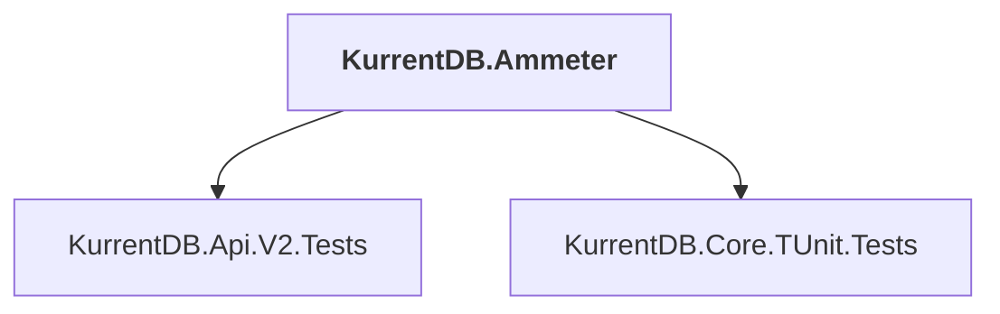

# KurrentDB.Ammeter

## Overview

| Property | Value |
|----------|-------|
| Category | Library |
| Repository | src |
| Path | `KurrentDB.Ammeter/KurrentDB.Ammeter.csproj` |
| Project References | 2 |
| NuGet Dependencies | 3 |
| Consumers | 0 |

## Dependency Diagram

## Project References
- KurrentDB.Api.V2.Tests
- KurrentDB.Core.TUnit.Tests

## External NuGet Packages
| Package | Version |
|---------|---------||
| RestSharp |  |
| Testcontainers |  |
| Microsoft.Extensions.Configuration |  |

---

*[Back to Index](../index.md)*
