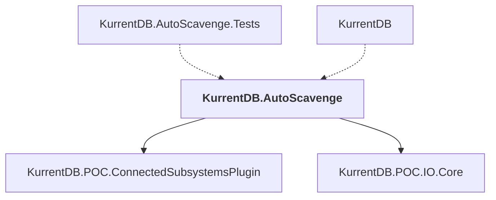

# KurrentDB.AutoScavenge

## Overview

| Property | Value |
|----------|-------|
| Category | Library |
| Repository | src |
| Path | `KurrentDB.AutoScavenge/KurrentDB.AutoScavenge.csproj` |
| Project References | 2 |
| NuGet Dependencies | 1 |
| Consumers | 2 |

## Dependency Diagram

## Project References
- KurrentDB.POC.ConnectedSubsystemsPlugin
- KurrentDB.POC.IO.Core

## Consumed By
- KurrentDB.AutoScavenge.Tests
- KurrentDB

## External NuGet Packages
| Package | Version |
|---------|---------||
| NCrontab |  |

---

*[Back to Index](../index.md)*
