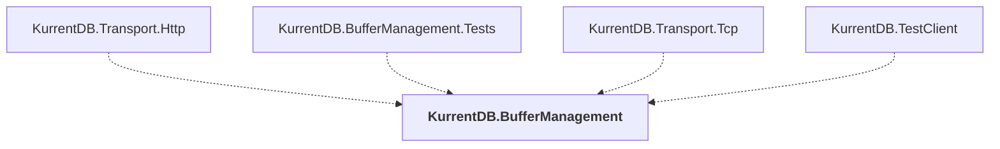

# KurrentDB.BufferManagement

## Overview

| Property | Value |
|----------|-------|
| Category | Library |
| Repository | src |
| Path | `KurrentDB.BufferManagement/KurrentDB.BufferManagement.csproj` |
| Project References | 0 |
| NuGet Dependencies | 1 |
| Consumers | 4 |

## Dependency Diagram

## Consumed By
- KurrentDB.Transport.Http
- KurrentDB.BufferManagement.Tests
- KurrentDB.Transport.Tcp
- KurrentDB.TestClient

## External NuGet Packages
| Package | Version |
|---------|---------||
| Serilog |  |

---

*[Back to Index](../index.md)*
