# KurrentDB.Common

## Overview

| Property | Value |
|----------|-------|
| Category | Library |
| Repository | src |
| Path | `KurrentDB.Common/KurrentDB.Common.csproj` |
| Project References | 1 |
| NuGet Dependencies | 17 |
| Consumers | 14 |

## Dependency Diagram

```mermaid
graph TD
    KurrentDB_Common["<strong>KurrentDB.Common</strong>"]
    KurrentDB_SystemRuntime["KurrentDB.SystemRuntime"]
    KurrentDB_Common --> KurrentDB_SystemRuntime
    KurrentDB_Auth_UserCertificates_Tests["KurrentDB.Auth.UserCertificates.Tests"]
    KurrentDB_Auth_UserCertificates_Tests -.-> KurrentDB_Common
    KurrentDB_Projections_Core_Tests["KurrentDB.Projections.Core.Tests"]
    KurrentDB_Projections_Core_Tests -.-> KurrentDB_Common
    KurrentDB_Common_Tests["KurrentDB.Common.Tests"]
    KurrentDB_Common_Tests -.-> KurrentDB_Common
    KurrentDB_Security_EncryptionAtRest_Tests["KurrentDB.Security.EncryptionAtRest.Tests"]
    KurrentDB_Security_EncryptionAtRest_Tests -.-> KurrentDB_Common
    KurrentDB_Transport_Http["KurrentDB.Transport.Http"]
    KurrentDB_Transport_Http -.-> KurrentDB_Common
    KurrentDB_Projections_Core["KurrentDB.Projections.Core"]
    KurrentDB_Projections_Core -.-> KurrentDB_Common
    KurrentDB_Logging["KurrentDB.Logging"]
    KurrentDB_Logging -.-> KurrentDB_Common
    KurrentDB_Diagnostics_LogsEndpointPlugin_Tests["KurrentDB.Diagnostics.LogsEndpointPlugin.Tests"]
    KurrentDB_Diagnostics_LogsEndpointPlugin_Tests -.-> KurrentDB_Common
    KurrentDB_Transport_Tcp["KurrentDB.Transport.Tcp"]
    KurrentDB_Transport_Tcp -.-> KurrentDB_Common
    KurrentDB_TestClient["KurrentDB.TestClient"]
    KurrentDB_TestClient -.-> KurrentDB_Common
    KurrentDB_SecondaryIndexing["KurrentDB.SecondaryIndexing"]
    KurrentDB_SecondaryIndexing -.-> KurrentDB_Common
    KurrentDB_Core["KurrentDB.Core"]
    KurrentDB_Core -.-> KurrentDB_Common
    KurrentDB_Connectors["KurrentDB.Connectors"]
    KurrentDB_Connectors -.-> KurrentDB_Common
    KurrentDB["KurrentDB"]
    KurrentDB -.-> KurrentDB_Common
```

## Project References
- KurrentDB.SystemRuntime

## Consumed By
- KurrentDB.Auth.UserCertificates.Tests
- KurrentDB.Projections.Core.Tests
- KurrentDB.Common.Tests
- KurrentDB.Security.EncryptionAtRest.Tests
- KurrentDB.Transport.Http
- KurrentDB.Projections.Core
- KurrentDB.Logging
- KurrentDB.Diagnostics.LogsEndpointPlugin.Tests
- KurrentDB.Transport.Tcp
- KurrentDB.TestClient
- KurrentDB.SecondaryIndexing
- KurrentDB.Core
- KurrentDB.Connectors
- KurrentDB

## External NuGet Packages
| Package | Version |
|---------|---------||
| GitInfo |  |
| NetEscapades.Configuration.Yaml |  |
| Newtonsoft.Json |  |
| OpenTelemetry |  |
| Grpc.Net.Common |  |
| Serilog |  |
| Serilog.Enrichers.Process |  |
| Serilog.Enrichers.Thread |  |
| Serilog.Expressions |  |
| Serilog.Extensions.Logging |  |
| Serilog.Settings.Configuration |  |
| Serilog.Sinks.Async |  |
| Serilog.Sinks.File |  |
| Serilog.Sinks.Seq |  |
| Serilog.Sinks.Console |  |
| System.Security.Cryptography.Pkcs |  |
| YamlDotnet |  |

---

*[Back to Index](../index.md)*
