# KurrentDB.Core

## Overview

| Property | Value |
|----------|-------|
| Category | Library |
| Repository | src |
| Path | `KurrentDB.Core/KurrentDB.Core.csproj` |
| Project References | 11 |
| NuGet Dependencies | 27 |
| Consumers | 17 |

## Dependency Diagram

```mermaid
graph TD
    KurrentDB_Core["<strong>KurrentDB.Core</strong>"]
    KurrentDB_Common["KurrentDB.Common"]
    KurrentDB_Core --> KurrentDB_Common
    KurrentDB_DuckDB["KurrentDB.DuckDB"]
    KurrentDB_Core --> KurrentDB_DuckDB
    KurrentDB_Licensing["KurrentDB.Licensing"]
    KurrentDB_Core --> KurrentDB_Licensing
    KurrentDB_Logging["KurrentDB.Logging"]
    KurrentDB_Core --> KurrentDB_Logging
    KurrentDB_LogV3["KurrentDB.LogV3"]
    KurrentDB_Core --> KurrentDB_LogV3
    KurrentDB_Native["KurrentDB.Native"]
    KurrentDB_Core --> KurrentDB_Native
    KurrentDB_Plugins["KurrentDB.Plugins"]
    KurrentDB_Core --> KurrentDB_Plugins
    KurrentDB_Transport_Http["KurrentDB.Transport.Http"]
    KurrentDB_Core --> KurrentDB_Transport_Http
    KurrentDB_Transport_Tcp["KurrentDB.Transport.Tcp"]
    KurrentDB_Core --> KurrentDB_Transport_Tcp
    KurrentDB_NETCore_Compatibility["KurrentDB.NETCore.Compatibility"]
    KurrentDB_Core --> KurrentDB_NETCore_Compatibility
    KurrentDB_SourceGenerators["KurrentDB.SourceGenerators"]
    KurrentDB_Core --> KurrentDB_SourceGenerators
    KurrentDB_Core_Testing["KurrentDB.Core.Testing"]
    KurrentDB_Core_Testing -.-> KurrentDB_Core
    KurrentDB_Licensing_Tests["KurrentDB.Licensing.Tests"]
    KurrentDB_Licensing_Tests -.-> KurrentDB_Core
    KurrentDB_Projections_Core_Tests["KurrentDB.Projections.Core.Tests"]
    KurrentDB_Projections_Core_Tests -.-> KurrentDB_Core
    KurrentDB_Auth_StreamPolicyPlugin["KurrentDB.Auth.StreamPolicyPlugin"]
    KurrentDB_Auth_StreamPolicyPlugin -.-> KurrentDB_Core
    KurrentDB_Api_V2["KurrentDB.Api.V2"]
    KurrentDB_Api_V2 -.-> KurrentDB_Core
    KurrentDB_Surge["KurrentDB.Surge"]
    KurrentDB_Surge -.-> KurrentDB_Core
    KurrentDB_Projections_Core["KurrentDB.Projections.Core"]
    KurrentDB_Projections_Core -.-> KurrentDB_Core
    KurrentDB_POC_ConnectedSubsystemsPlugin["KurrentDB.POC.ConnectedSubsystemsPlugin"]
    KurrentDB_POC_ConnectedSubsystemsPlugin -.-> KurrentDB_Core
    KurrentDB_SystemRuntime_Tests["KurrentDB.SystemRuntime.Tests"]
    KurrentDB_SystemRuntime_Tests -.-> KurrentDB_Core
    KurrentDB_TestClient["KurrentDB.TestClient"]
    KurrentDB_TestClient -.-> KurrentDB_Core
    KurrentDB_Core_XUnit_Tests["KurrentDB.Core.XUnit.Tests"]
    KurrentDB_Core_XUnit_Tests -.-> KurrentDB_Core
    KurrentDB_SecondaryIndexing["KurrentDB.SecondaryIndexing"]
    KurrentDB_SecondaryIndexing -.-> KurrentDB_Core
    KurrentDB_SecondaryIndexing_Tests["KurrentDB.SecondaryIndexing.Tests"]
    KurrentDB_SecondaryIndexing_Tests -.-> KurrentDB_Core
    KurrentDB_POC_IO_Core["KurrentDB.POC.IO.Core"]
    KurrentDB_POC_IO_Core -.-> KurrentDB_Core
    KurrentDB_Connectors["KurrentDB.Connectors"]
    KurrentDB_Connectors -.-> KurrentDB_Core
    more_consumers["... +2 more"]
    more_consumers -.-> KurrentDB_Core
```

## Project References
- KurrentDB.Common
- KurrentDB.DuckDB
- KurrentDB.Licensing
- KurrentDB.Logging
- KurrentDB.LogV3
- KurrentDB.Native
- KurrentDB.Plugins
- KurrentDB.Transport.Http
- KurrentDB.Transport.Tcp
- KurrentDB.NETCore.Compatibility
- KurrentDB.SourceGenerators

## Consumed By
- KurrentDB.Core.Testing
- KurrentDB.Licensing.Tests
- KurrentDB.Projections.Core.Tests
- KurrentDB.Auth.StreamPolicyPlugin
- KurrentDB.Api.V2
- KurrentDB.Surge
- KurrentDB.Projections.Core
- KurrentDB.POC.ConnectedSubsystemsPlugin
- KurrentDB.SystemRuntime.Tests
- KurrentDB.TestClient
- KurrentDB.Core.XUnit.Tests
- KurrentDB.SecondaryIndexing
- KurrentDB.SecondaryIndexing.Tests
- KurrentDB.POC.IO.Core
- KurrentDB.Connectors
- KurrentDB.TcpPlugin
- KurrentDB

## External NuGet Packages
| Package | Version |
|---------|---------||
| Kurrent.Quack |  |
| FluentStorage |  |
| FluentStorage.AWS |  |
| Azure.Storage.Blobs |  |
| Azure.Identity |  |
| Google.Cloud.Storage.V1 |  |
| Google.Protobuf |  |
| Grpc.AspNetCore |  |
| Grpc.Tools |  |
| librdkafka.redist |  |
| Microsoft.FASTER.Core |  |
| Microsoft.AspNetCore.Authentication.OpenIdConnect |  |
| Microsoft.IdentityModel.Protocols.OpenIdConnect |  |
| OpenTelemetry.Exporter.Prometheus.AspNetCore |  |
| OpenTelemetry.Extensions.Hosting |  |
| OpenTelemetry.Instrumentation.AspNetCore |  |
| Polly.Core |  |
| Quickenshtein |  |
| System.Diagnostics.PerformanceCounter |  |
| System.Linq.Async |  |
| Microsoft.Diagnostics.NETCore.Client |  |
| Microsoft.Diagnostics.Tracing.TraceEvent |  |
| Microsoft.Data.Sqlite |  |
| DotNext.IO |  |
| DotNext.Threading |  |
| DotNext.Unsafe |  |
| Scrutor |  |

---

*[Back to Index](../index.md)*
