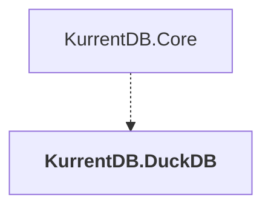

# KurrentDB.DuckDB

## Overview

| Property | Value |
|----------|-------|
| Category | Library |
| Repository | src |
| Path | `KurrentDB.DuckDB/KurrentDB.DuckDB.csproj` |
| Project References | 0 |
| NuGet Dependencies | 3 |
| Consumers | 1 |

## Dependency Diagram

## Consumed By
- KurrentDB.Core

## External NuGet Packages
| Package | Version |
|---------|---------||
| Kurrent.Quack |  |
| Microsoft.Extensions.DependencyInjection.Abstractions |  |
| Serilog |  |

---

*[Back to Index](../index.md)*
