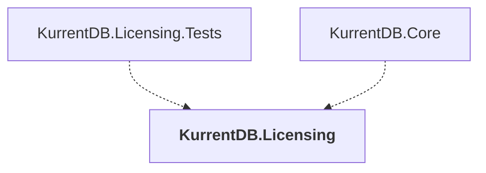

# KurrentDB.Licensing

## Overview

| Property | Value |
|----------|-------|
| Category | Library |
| Repository | src |
| Path | `KurrentDB.Licensing/KurrentDB.Licensing.csproj` |
| Project References | 0 |
| NuGet Dependencies | 2 |
| Consumers | 2 |

## Dependency Diagram

## Consumed By
- KurrentDB.Licensing.Tests
- KurrentDB.Core

## External NuGet Packages
| Package | Version |
|---------|---------||
| RestSharp |  |
| Serilog |  |

---

*[Back to Index](../index.md)*
