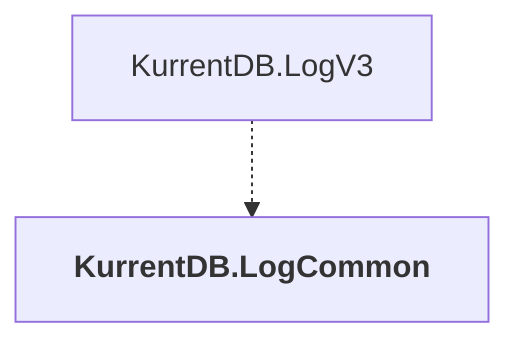

# KurrentDB.LogCommon

## Overview

| Property | Value |
|----------|-------|
| Category | Library |
| Repository | src |
| Path | `KurrentDB.LogCommon/KurrentDB.LogCommon.csproj` |
| Project References | 0 |
| NuGet Dependencies | 0 |
| Consumers | 1 |

## Dependency Diagram

## Consumed By
- KurrentDB.LogV3

---

*[Back to Index](../index.md)*
