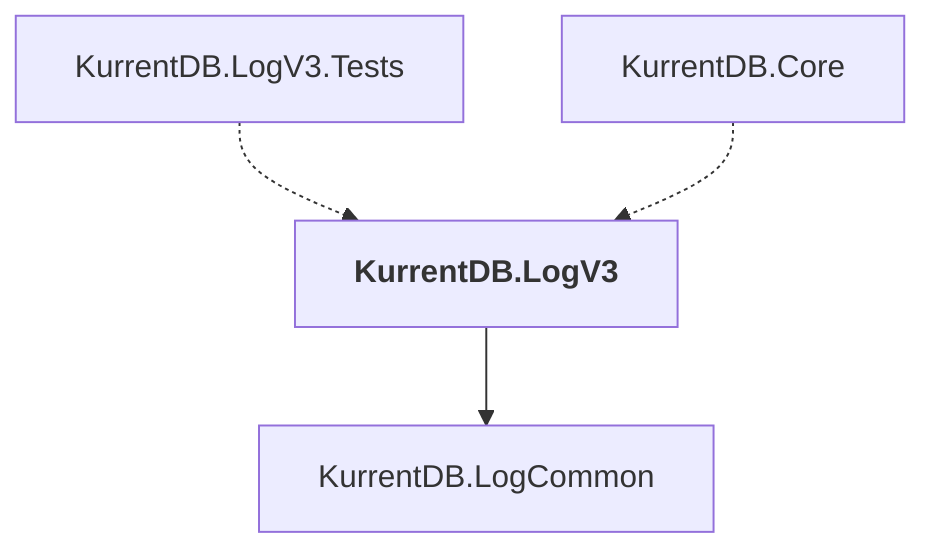

# KurrentDB.LogV3

## Overview

| Property | Value |
|----------|-------|
| Category | Library |
| Repository | src |
| Path | `KurrentDB.LogV3/KurrentDB.LogV3.csproj` |
| Project References | 1 |
| NuGet Dependencies | 2 |
| Consumers | 2 |

## Dependency Diagram

## Project References
- KurrentDB.LogCommon

## Consumed By
- KurrentDB.LogV3.Tests
- KurrentDB.Core

## External NuGet Packages
| Package | Version |
|---------|---------||
| Google.Protobuf |  |
| Grpc.Tools |  |

---

*[Back to Index](../index.md)*
