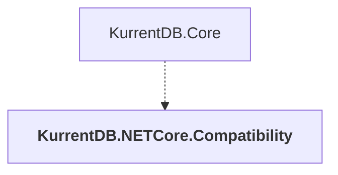

# KurrentDB.NETCore.Compatibility

## Overview

| Property | Value |
|----------|-------|
| Category | Library |
| Repository | src |
| Path | `KurrentDB.NETCore.Compatibility/KurrentDB.NETCore.Compatibility.csproj` |
| Project References | 0 |
| NuGet Dependencies | 3 |
| Consumers | 1 |

## Dependency Diagram

## Consumed By
- KurrentDB.Core

## External NuGet Packages
| Package | Version |
|---------|---------||
| System.ServiceModel.Http |  |
| System.Security.Cryptography.Pkcs |  |
| System.Security.Cryptography.Xml |  |

---

*[Back to Index](../index.md)*
