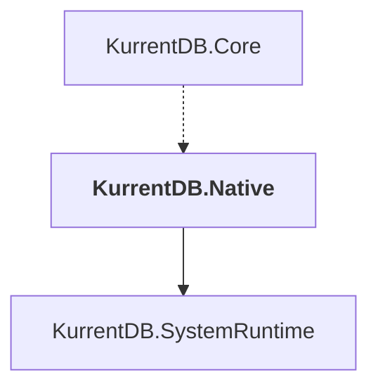

# KurrentDB.Native

## Overview

| Property | Value |
|----------|-------|
| Category | Library |
| Repository | src |
| Path | `KurrentDB.Native/KurrentDB.Native.csproj` |
| Project References | 1 |
| NuGet Dependencies | 1 |
| Consumers | 1 |

## Dependency Diagram

## Project References
- KurrentDB.SystemRuntime

## Consumed By
- KurrentDB.Core

## External NuGet Packages
| Package | Version |
|---------|---------||
| Mono.Posix.NETStandard |  |

---

*[Back to Index](../index.md)*
