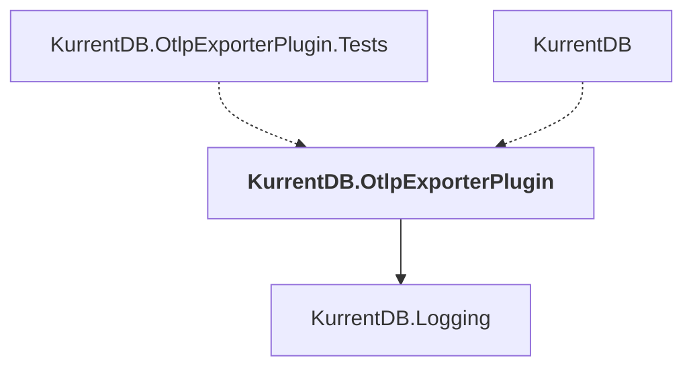

# KurrentDB.OtlpExporterPlugin

## Overview

| Property | Value |
|----------|-------|
| Category | Library |
| Repository | src |
| Path | `KurrentDB.OtlpExporterPlugin/KurrentDB.OtlpExporterPlugin.csproj` |
| Project References | 1 |
| NuGet Dependencies | 4 |
| Consumers | 2 |

## Dependency Diagram

## Project References
- KurrentDB.Logging

## Consumed By
- KurrentDB.OtlpExporterPlugin.Tests
- KurrentDB

## External NuGet Packages
| Package | Version |
|---------|---------||
| OpenTelemetry.Exporter.OpenTelemetryProtocol |  |
| OpenTelemetry.Extensions.Hosting |  |
| Serilog |  |
| Serilog.Sinks.OpenTelemetry |  |

---

*[Back to Index](../index.md)*
