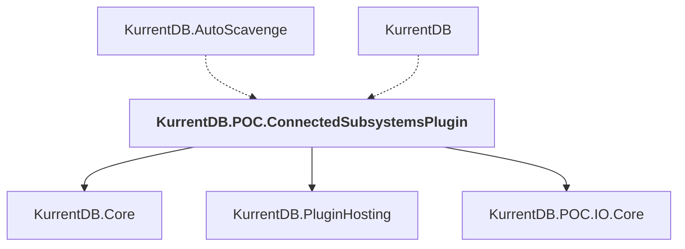

# KurrentDB.POC.ConnectedSubsystemsPlugin

## Overview

| Property | Value |
|----------|-------|
| Category | Library |
| Repository | src |
| Path | `KurrentDB.POC.ConnectedSubsystemsPlugin/KurrentDB.POC.ConnectedSubsystemsPlugin.csproj` |
| Project References | 3 |
| NuGet Dependencies | 1 |
| Consumers | 2 |

## Dependency Diagram

## Project References
- KurrentDB.Core
- KurrentDB.PluginHosting
- KurrentDB.POC.IO.Core

## Consumed By
- KurrentDB.AutoScavenge
- KurrentDB

## External NuGet Packages
| Package | Version |
|---------|---------||
| System.Linq.Async |  |

---

*[Back to Index](../index.md)*
