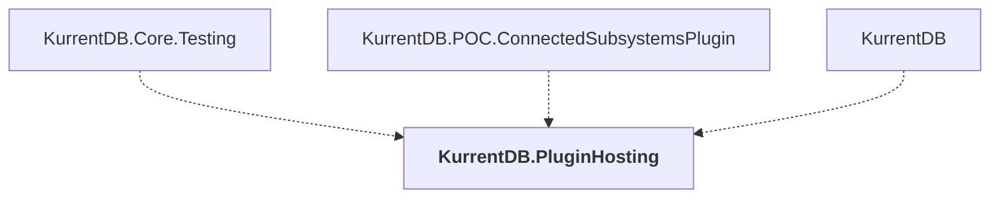

# KurrentDB.PluginHosting

## Overview

| Property | Value |
|----------|-------|
| Category | Library |
| Repository | src |
| Path | `KurrentDB.PluginHosting/KurrentDB.PluginHosting.csproj` |
| Project References | 0 |
| NuGet Dependencies | 0 |
| Consumers | 3 |

## Dependency Diagram

## Consumed By
- KurrentDB.Core.Testing
- KurrentDB.POC.ConnectedSubsystemsPlugin
- KurrentDB

---

*[Back to Index](../index.md)*
