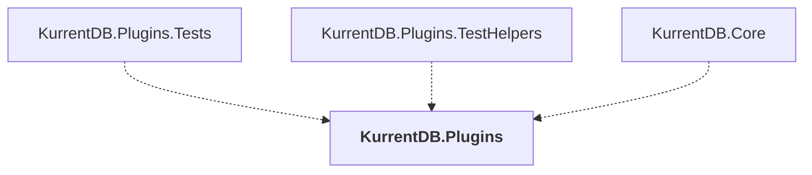

# KurrentDB.Plugins

## Overview

| Property | Value |
|----------|-------|
| Category | Library |
| Repository | src |
| Path | `KurrentDB.Plugins/KurrentDB.Plugins.csproj` |
| Project References | 0 |
| NuGet Dependencies | 3 |
| Consumers | 3 |

## Dependency Diagram

## Consumed By
- KurrentDB.Plugins.Tests
- KurrentDB.Plugins.TestHelpers
- KurrentDB.Core

## External NuGet Packages
| Package | Version |
|---------|---------||
| Microsoft.IdentityModel.JsonWebTokens |  |
| YamlDotNet |  |
| System.Reactive |  |

---

*[Back to Index](../index.md)*
