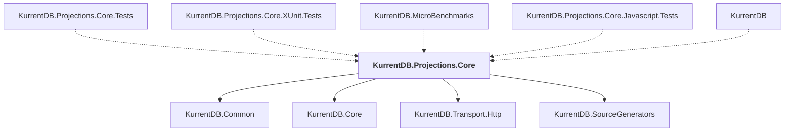

# KurrentDB.Projections.Core

## Overview

| Property | Value |
|----------|-------|
| Category | Library |
| Repository | src |
| Path | `KurrentDB.Projections.Core/KurrentDB.Projections.Core.csproj` |
| Project References | 4 |
| NuGet Dependencies | 3 |
| Consumers | 5 |

## Dependency Diagram

## Project References
- KurrentDB.Common
- KurrentDB.Core
- KurrentDB.Transport.Http
- KurrentDB.SourceGenerators

## Consumed By
- KurrentDB.Projections.Core.Tests
- KurrentDB.Projections.Core.XUnit.Tests
- KurrentDB.MicroBenchmarks
- KurrentDB.Projections.Core.Javascript.Tests
- KurrentDB

## External NuGet Packages
| Package | Version |
|---------|---------||
| Grpc.Tools |  |
| Newtonsoft.Json |  |
| Jint |  |

---

*[Back to Index](../index.md)*
