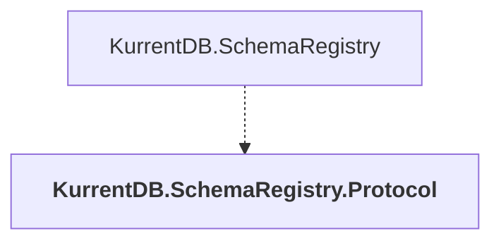

# KurrentDB.SchemaRegistry.Protocol

## Overview

| Property | Value |
|----------|-------|
| Category | Library |
| Repository | src |
| Path | `SchemaRegistry/KurrentDB.SchemaRegistry.Protocol/KurrentDB.SchemaRegistry.Protocol.csproj` |
| Project References | 0 |
| NuGet Dependencies | 4 |
| Consumers | 1 |

## Dependency Diagram

## Consumed By
- KurrentDB.SchemaRegistry

## External NuGet Packages
| Package | Version |
|---------|---------||
| Google.Protobuf |  |
| Grpc.Net.ClientFactory |  |
| Grpc.StatusProto |  |
| Grpc.Tools |  |

---

*[Back to Index](../index.md)*
