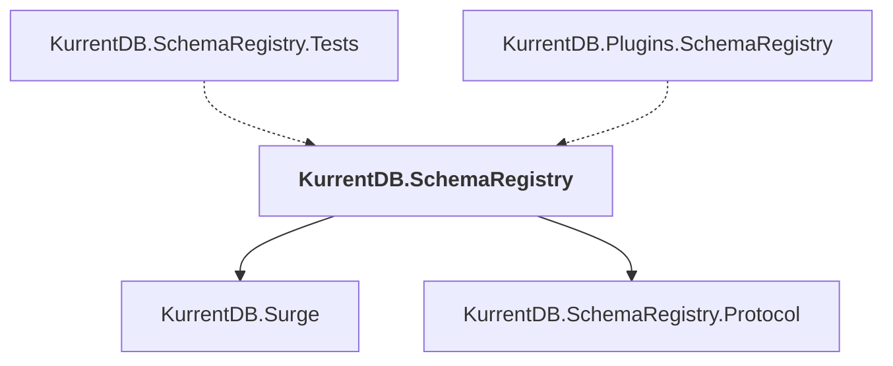

# KurrentDB.SchemaRegistry

## Overview

| Property | Value |
|----------|-------|
| Category | Library |
| Repository | src |
| Path | `SchemaRegistry/KurrentDB.SchemaRegistry/KurrentDB.SchemaRegistry.csproj` |
| Project References | 2 |
| NuGet Dependencies | 6 |
| Consumers | 2 |

## Dependency Diagram

## Project References
- KurrentDB.Surge
- KurrentDB.SchemaRegistry.Protocol

## Consumed By
- KurrentDB.SchemaRegistry.Tests
- KurrentDB.Plugins.SchemaRegistry

## External NuGet Packages
| Package | Version |
|---------|---------||
| FluentValidation.DependencyInjectionExtensions |  |
| Grpc.AspNetCore |  |
| Kurrent.Quack |  |
| Kurrent.Surge.DuckDB |  |
| Kurrent.Surge.Core |  |
| NJsonSchema |  |

---

*[Back to Index](../index.md)*
