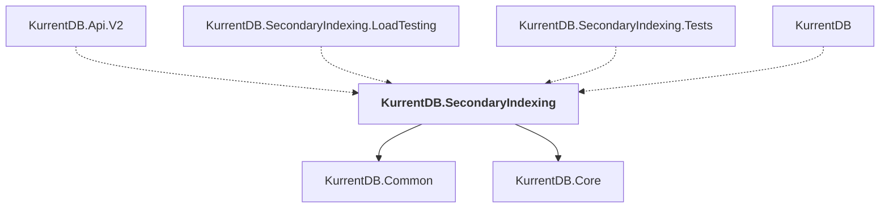

# KurrentDB.SecondaryIndexing

## Overview

| Property | Value |
|----------|-------|
| Category | Library |
| Repository | src |
| Path | `KurrentDB.SecondaryIndexing/KurrentDB.SecondaryIndexing.csproj` |
| Project References | 2 |
| NuGet Dependencies | 8 |
| Consumers | 4 |

## Dependency Diagram

## Project References
- KurrentDB.Common
- KurrentDB.Core

## Consumed By
- KurrentDB.Api.V2
- KurrentDB.SecondaryIndexing.LoadTesting
- KurrentDB.SecondaryIndexing.Tests
- KurrentDB

## External NuGet Packages
| Package | Version |
|---------|---------||
| Grpc.Tools |  |
| Kurrent.Quack |  |
| Kurrent.Surge.Core |  |
| Eventuous.Application |  |
| Eventuous.Extensions.DependencyInjection |  |
| Microsoft.AspNetCore.Grpc.JsonTranscoding |  |
| System.Linq.Async |  |
| Jint |  |

---

*[Back to Index](../index.md)*
