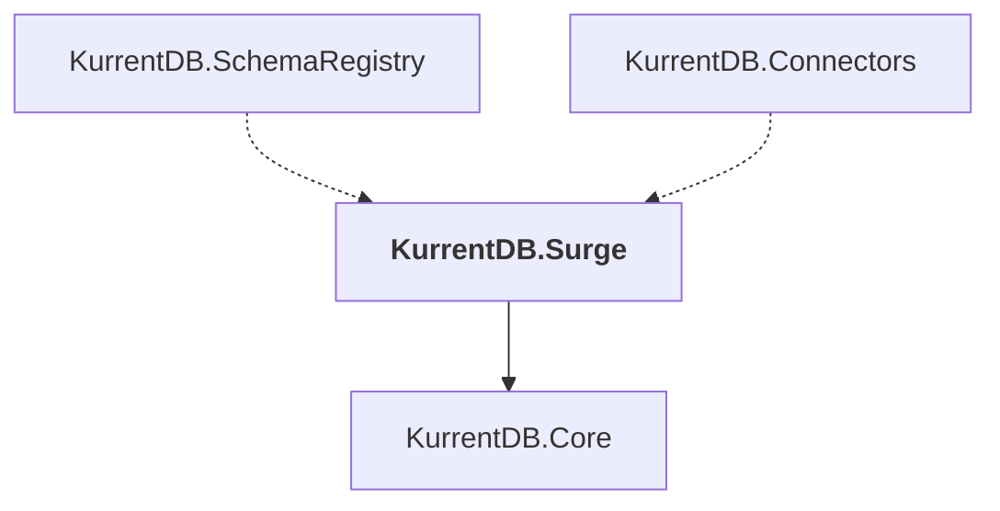

# KurrentDB.Surge

## Overview

| Property | Value |
|----------|-------|
| Category | Library |
| Repository | src |
| Path | `KurrentDB.Surge/KurrentDB.Surge.csproj` |
| Project References | 1 |
| NuGet Dependencies | 5 |
| Consumers | 2 |

## Dependency Diagram

## Project References
- KurrentDB.Core

## Consumed By
- KurrentDB.SchemaRegistry
- KurrentDB.Connectors

## External NuGet Packages
| Package | Version |
|---------|---------||
| Kurrent.Surge.Core |  |
| Eventuous.Application |  |
| Eventuous.Extensions.AspNetCore |  |
| Eventuous.Extensions.DependencyInjection |  |
| System.Linq.Async |  |

---

*[Back to Index](../index.md)*
