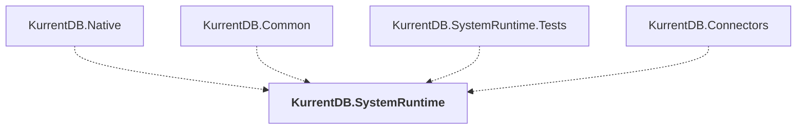

# KurrentDB.SystemRuntime

## Overview

| Property | Value |
|----------|-------|
| Category | Library |
| Repository | src |
| Path | `KurrentDB.SystemRuntime/KurrentDB.SystemRuntime.csproj` |
| Project References | 0 |
| NuGet Dependencies | 2 |
| Consumers | 4 |

## Dependency Diagram

## Consumed By
- KurrentDB.Native
- KurrentDB.Common
- KurrentDB.SystemRuntime.Tests
- KurrentDB.Connectors

## External NuGet Packages
| Package | Version |
|---------|---------||
| Serilog |  |
| System.Diagnostics.PerformanceCounter |  |

---

*[Back to Index](../index.md)*
