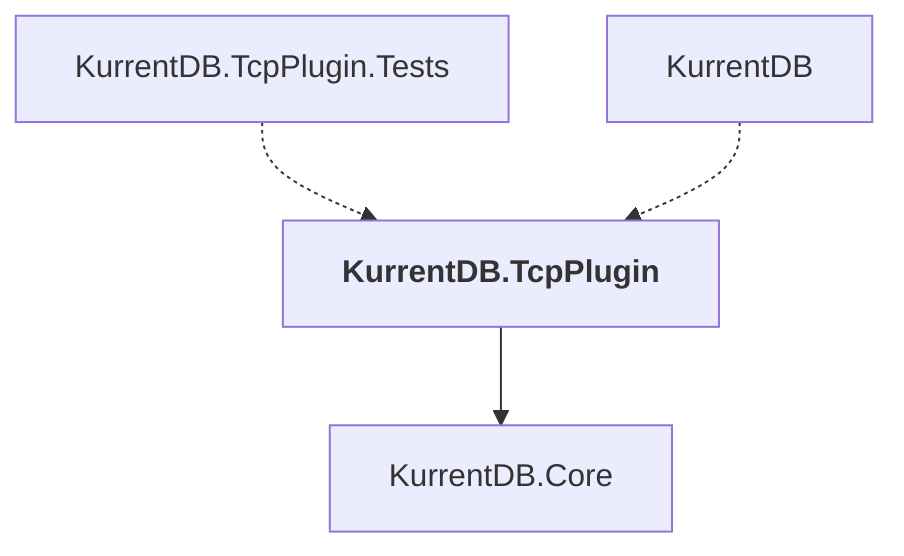

# KurrentDB.TcpPlugin

## Overview

| Property | Value |
|----------|-------|
| Category | Library |
| Repository | src |
| Path | `KurrentDB.TcpPlugin/KurrentDB.TcpPlugin.csproj` |
| Project References | 1 |
| NuGet Dependencies | 0 |
| Consumers | 2 |

## Dependency Diagram

## Project References
- KurrentDB.Core

## Consumed By
- KurrentDB.TcpPlugin.Tests
- KurrentDB

---

*[Back to Index](../index.md)*
