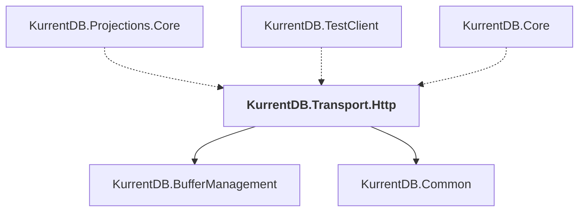

# KurrentDB.Transport.Http

## Overview

| Property | Value |
|----------|-------|
| Category | Library |
| Repository | src |
| Path | `KurrentDB.Transport.Http/KurrentDB.Transport.Http.csproj` |
| Project References | 2 |
| NuGet Dependencies | 0 |
| Consumers | 3 |

## Dependency Diagram

## Project References
- KurrentDB.BufferManagement
- KurrentDB.Common

## Consumed By
- KurrentDB.Projections.Core
- KurrentDB.TestClient
- KurrentDB.Core

---

*[Back to Index](../index.md)*
