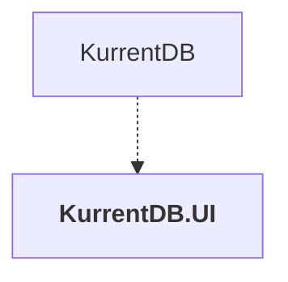

# KurrentDB.UI

## Overview

| Property | Value |
|----------|-------|
| Category | Library |
| Repository | src |
| Path | `KurrentDB.UI/KurrentDB.UI.csproj` |
| Project References | 0 |
| NuGet Dependencies | 4 |
| Consumers | 1 |

## Dependency Diagram

## Consumed By
- KurrentDB

## External NuGet Packages
| Package | Version |
|---------|---------||
| Microsoft.AspNetCore.Components.WebAssembly |  |
| Microsoft.AspNetCore.Components.WebAssembly.Authentication |  |
| Extensions.MudBlazor.StaticInput |  |
| MudBlazor |  |

---

*[Back to Index](../index.md)*
