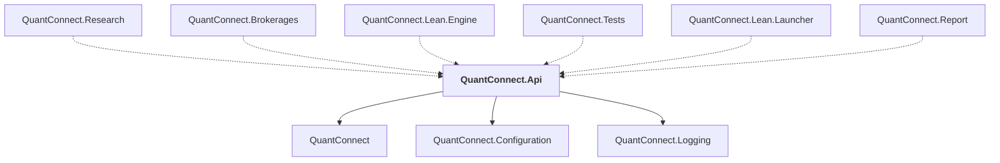

# QuantConnect.Api

## Overview

| Property | Value |
|----------|-------|
| Category | WebApp |
| Repository | Lean |
| Path | `Api/QuantConnect.Api.csproj` |
| Project References | 3 |
| NuGet Dependencies | 3 |
| Consumers | 6 |

## Dependency Diagram

## Project References
- QuantConnect
- QuantConnect.Configuration
- QuantConnect.Logging

## Consumed By
- QuantConnect.Research
- QuantConnect.Brokerages
- QuantConnect.Lean.Engine
- QuantConnect.Tests
- QuantConnect.Lean.Launcher
- QuantConnect.Report

## External NuGet Packages
| Package | Version |
|---------|---------||
| Newtonsoft.Json | 13.0.2 |
| NodaTime | 3.0.5 |
| RestSharp | 106.12.0 |

---

*[Back to Index](../index.md)*
