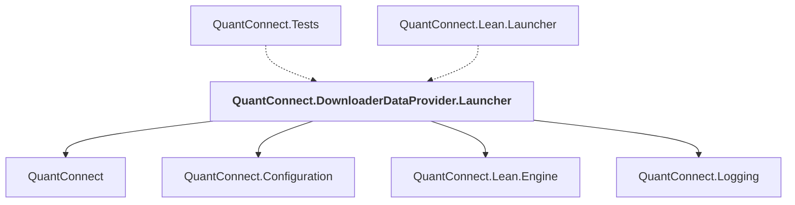

# QuantConnect.DownloaderDataProvider.Launcher

## Overview

| Property | Value |
|----------|-------|
| Category | Application |
| Repository | Lean |
| Path | `DownloaderDataProvider/QuantConnect.DownloaderDataProvider.Launcher.csproj` |
| Project References | 4 |
| NuGet Dependencies | 0 |
| Consumers | 2 |

## Dependency Diagram

## Project References
- QuantConnect
- QuantConnect.Configuration
- QuantConnect.Lean.Engine
- QuantConnect.Logging

## Consumed By
- QuantConnect.Tests
- QuantConnect.Lean.Launcher

---

*[Back to Index](../index.md)*
