# QuantConnect.Lean.Launcher

## Overview

| Property | Value |
|----------|-------|
| Category | Application |
| Repository | Lean |
| Path | `Launcher/QuantConnect.Lean.Launcher.csproj` |
| Project References | 17 |
| NuGet Dependencies | 1 |
| Consumers | 1 |

## Dependency Diagram

```mermaid
graph TD
    QuantConnect_Lean_Launcher["<strong>QuantConnect.Lean.Launcher</strong>"]
    QuantConnect_Algorithm_CSharp["QuantConnect.Algorithm.CSharp"]
    QuantConnect_Lean_Launcher --> QuantConnect_Algorithm_CSharp
    QuantConnect_AlgorithmFactory["QuantConnect.AlgorithmFactory"]
    QuantConnect_Lean_Launcher --> QuantConnect_AlgorithmFactory
    QuantConnect_Algorithm["QuantConnect.Algorithm"]
    QuantConnect_Lean_Launcher --> QuantConnect_Algorithm
    QuantConnect_Api["QuantConnect.Api"]
    QuantConnect_Lean_Launcher --> QuantConnect_Api
    QuantConnect_Brokerages["QuantConnect.Brokerages"]
    QuantConnect_Lean_Launcher --> QuantConnect_Brokerages
    QuantConnect_Compression["QuantConnect.Compression"]
    QuantConnect_Lean_Launcher --> QuantConnect_Compression
    QuantConnect_Configuration["QuantConnect.Configuration"]
    QuantConnect_Lean_Launcher --> QuantConnect_Configuration
    QuantConnect_DownloaderDataProvider_Launcher["QuantConnect.DownloaderDataProvider.Launcher"]
    QuantConnect_Lean_Launcher --> QuantConnect_DownloaderDataProvider_Launcher
    QuantConnect_Lean_Engine["QuantConnect.Lean.Engine"]
    QuantConnect_Lean_Launcher --> QuantConnect_Lean_Engine
    QuantConnect_Indicators["QuantConnect.Indicators"]
    QuantConnect_Lean_Launcher --> QuantConnect_Indicators
    QuantConnect["QuantConnect"]
    QuantConnect_Lean_Launcher --> QuantConnect
    QuantConnect_Optimizer_Launcher["QuantConnect.Optimizer.Launcher"]
    QuantConnect_Lean_Launcher --> QuantConnect_Optimizer_Launcher
    QuantConnect_Research["QuantConnect.Research"]
    QuantConnect_Lean_Launcher --> QuantConnect_Research
    QuantConnect_Logging["QuantConnect.Logging"]
    QuantConnect_Lean_Launcher --> QuantConnect_Logging
    QuantConnect_Messaging["QuantConnect.Messaging"]
    QuantConnect_Lean_Launcher --> QuantConnect_Messaging
    QuantConnect_Queues["QuantConnect.Queues"]
    QuantConnect_Lean_Launcher --> QuantConnect_Queues
    QuantConnect_ToolBox["QuantConnect.ToolBox"]
    QuantConnect_Lean_Launcher --> QuantConnect_ToolBox
    QuantConnect_Tests["QuantConnect.Tests"]
    QuantConnect_Tests -.-> QuantConnect_Lean_Launcher
```

## Project References
- QuantConnect.Algorithm.CSharp
- QuantConnect.AlgorithmFactory
- QuantConnect.Algorithm
- QuantConnect.Api
- QuantConnect.Brokerages
- QuantConnect.Compression
- QuantConnect.Configuration
- QuantConnect.DownloaderDataProvider.Launcher
- QuantConnect.Lean.Engine
- QuantConnect.Indicators
- QuantConnect
- QuantConnect.Optimizer.Launcher
- QuantConnect.Research
- QuantConnect.Logging
- QuantConnect.Messaging
- QuantConnect.Queues
- QuantConnect.ToolBox

## Consumed By
- QuantConnect.Tests

## External NuGet Packages
| Package | Version |
|---------|---------||
| DynamicInterop | 0.9.1 |

---

*[Back to Index](../index.md)*
