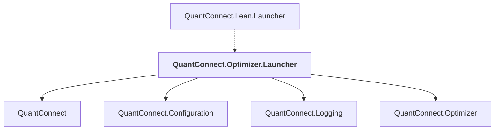

# QuantConnect.Optimizer.Launcher

## Overview

| Property | Value |
|----------|-------|
| Category | Application |
| Repository | Lean |
| Path | `Optimizer.Launcher/QuantConnect.Optimizer.Launcher.csproj` |
| Project References | 4 |
| NuGet Dependencies | 1 |
| Consumers | 1 |

## Dependency Diagram

## Project References
- QuantConnect
- QuantConnect.Configuration
- QuantConnect.Logging
- QuantConnect.Optimizer

## Consumed By
- QuantConnect.Lean.Launcher

## External NuGet Packages
| Package | Version |
|---------|---------||
| Newtonsoft.Json | 13.0.2 |

---

*[Back to Index](../index.md)*
