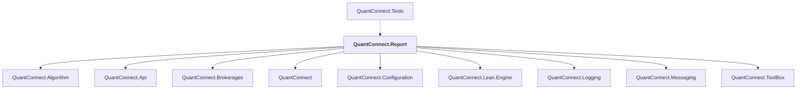

# QuantConnect.Report

## Overview

| Property | Value |
|----------|-------|
| Category | Application |
| Repository | Lean |
| Path | `Report/QuantConnect.Report.csproj` |
| Project References | 9 |
| NuGet Dependencies | 5 |
| Consumers | 1 |

## Dependency Diagram

## Project References
- QuantConnect.Algorithm
- QuantConnect.Api
- QuantConnect.Brokerages
- QuantConnect
- QuantConnect.Configuration
- QuantConnect.Lean.Engine
- QuantConnect.Logging
- QuantConnect.Messaging
- QuantConnect.ToolBox

## Consumed By
- QuantConnect.Tests

## External NuGet Packages
| Package | Version |
|---------|---------||
| QuantConnect.pythonnet | 2.0.52 |
| Deedle | 2.1.0 |
| MathNet.Numerics | 5.0.0 |
| Newtonsoft.Json | 13.0.2 |
| NodaTime | 3.0.5 |

---

*[Back to Index](../index.md)*
