# QuantConnect.Tests

## Overview

| Property | Value |
|----------|-------|
| Category | Test |
| Repository | Lean |
| Path | `Tests/QuantConnect.Tests.csproj` |
| Project References | 20 |
| NuGet Dependencies | 15 |
| Consumers | 0 |

## Dependency Diagram

```mermaid
graph TD
    QuantConnect_Tests["<strong>QuantConnect.Tests</strong>"]
    QuantConnect_Algorithm_CSharp["QuantConnect.Algorithm.CSharp"]
    QuantConnect_Tests --> QuantConnect_Algorithm_CSharp
    QuantConnect_Algorithm_Framework["QuantConnect.Algorithm.Framework"]
    QuantConnect_Tests --> QuantConnect_Algorithm_Framework
    QuantConnect_AlgorithmFactory["QuantConnect.AlgorithmFactory"]
    QuantConnect_Tests --> QuantConnect_AlgorithmFactory
    QuantConnect_Algorithm["QuantConnect.Algorithm"]
    QuantConnect_Tests --> QuantConnect_Algorithm
    QuantConnect_Api["QuantConnect.Api"]
    QuantConnect_Tests --> QuantConnect_Api
    QuantConnect_Brokerages["QuantConnect.Brokerages"]
    QuantConnect_Tests --> QuantConnect_Brokerages
    QuantConnect["QuantConnect"]
    QuantConnect_Tests --> QuantConnect
    QuantConnect_Compression["QuantConnect.Compression"]
    QuantConnect_Tests --> QuantConnect_Compression
    QuantConnect_Configuration["QuantConnect.Configuration"]
    QuantConnect_Tests --> QuantConnect_Configuration
    QuantConnect_DownloaderDataProvider_Launcher["QuantConnect.DownloaderDataProvider.Launcher"]
    QuantConnect_Tests --> QuantConnect_DownloaderDataProvider_Launcher
    QuantConnect_Lean_Engine["QuantConnect.Lean.Engine"]
    QuantConnect_Tests --> QuantConnect_Lean_Engine
    QuantConnect_Indicators["QuantConnect.Indicators"]
    QuantConnect_Tests --> QuantConnect_Indicators
    QuantConnect_Optimizer["QuantConnect.Optimizer"]
    QuantConnect_Tests --> QuantConnect_Optimizer
    QuantConnect_Research["QuantConnect.Research"]
    QuantConnect_Tests --> QuantConnect_Research
    QuantConnect_Lean_Launcher["QuantConnect.Lean.Launcher"]
    QuantConnect_Tests --> QuantConnect_Lean_Launcher
    QuantConnect_Logging["QuantConnect.Logging"]
    QuantConnect_Tests --> QuantConnect_Logging
    QuantConnect_Messaging["QuantConnect.Messaging"]
    QuantConnect_Tests --> QuantConnect_Messaging
    QuantConnect_Queues["QuantConnect.Queues"]
    QuantConnect_Tests --> QuantConnect_Queues
    QuantConnect_Report["QuantConnect.Report"]
    QuantConnect_Tests --> QuantConnect_Report
    QuantConnect_ToolBox["QuantConnect.ToolBox"]
    QuantConnect_Tests --> QuantConnect_ToolBox
```

## Project References
- QuantConnect.Algorithm.CSharp
- QuantConnect.Algorithm.Framework
- QuantConnect.AlgorithmFactory
- QuantConnect.Algorithm
- QuantConnect.Api
- QuantConnect.Brokerages
- QuantConnect
- QuantConnect.Compression
- QuantConnect.Configuration
- QuantConnect.DownloaderDataProvider.Launcher
- QuantConnect.Lean.Engine
- QuantConnect.Indicators
- QuantConnect.Optimizer
- QuantConnect.Research
- QuantConnect.Lean.Launcher
- QuantConnect.Logging
- QuantConnect.Messaging
- QuantConnect.Queues
- QuantConnect.Report
- QuantConnect.ToolBox

## External NuGet Packages
| Package | Version |
|---------|---------||
| QuantConnect.pythonnet | 2.0.52 |
| Accord | 3.6.0 |
| Accord.Math | 3.6.0 |
| Common.Logging | 3.4.1 |
| Common.Logging.Core | 3.4.1 |
| Deedle | 2.1.0 |
| Microsoft.NET.Test.Sdk | 16.9.4 |
| Microsoft.TestPlatform.ObjectModel | 16.9.4 |
| Moq | 4.16.1 |
| NetMQ | 4.0.1.6 |
| Newtonsoft.Json | 13.0.2 |
| NodaTime | 3.0.5 |
| NUnit | 4.2.2 |
| NUnit3TestAdapter | 4.6.0 |
| protobuf-net | 3.1.33 |

---

*[Back to Index](../index.md)*
