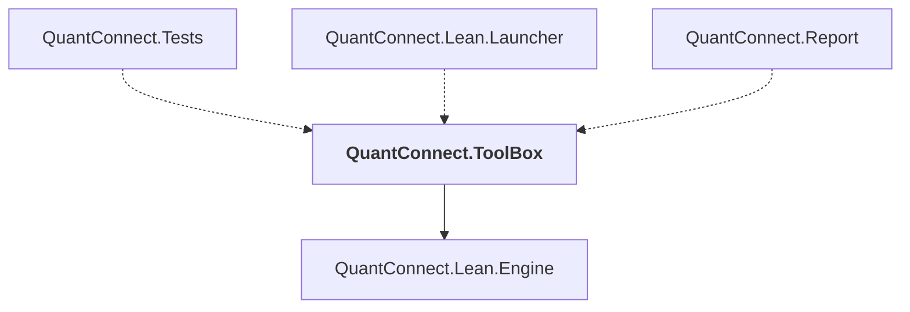

# QuantConnect.ToolBox

## Overview

| Property | Value |
|----------|-------|
| Category | Tool |
| Repository | Lean |
| Path | `ToolBox/QuantConnect.ToolBox.csproj` |
| Project References | 1 |
| NuGet Dependencies | 0 |
| Consumers | 3 |

## Dependency Diagram

## Project References
- QuantConnect.Lean.Engine

## Consumed By
- QuantConnect.Tests
- QuantConnect.Lean.Launcher
- QuantConnect.Report

---

*[Back to Index](../index.md)*
