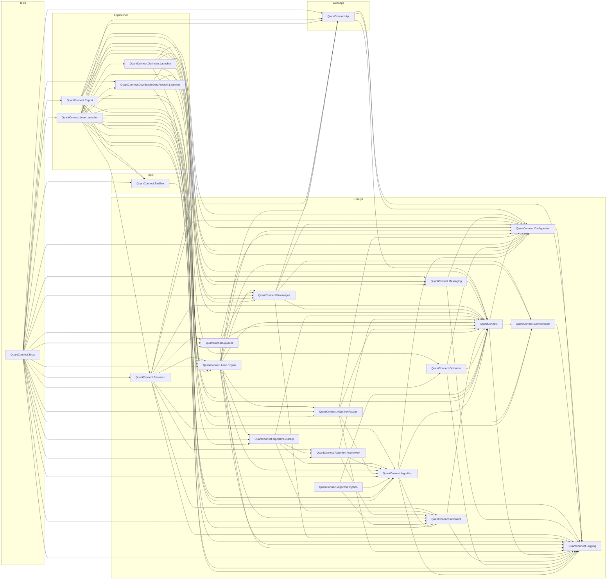
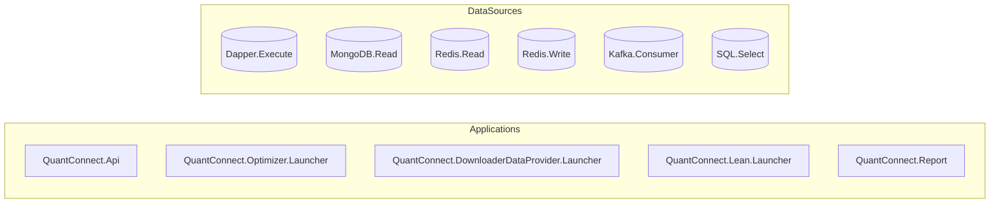
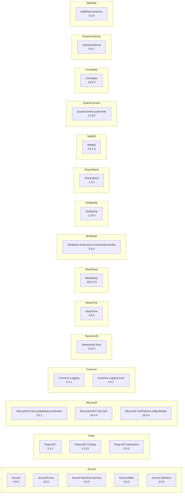

# Dependency Map

## Overview

| Metric | Count |
|--------|-------|
| Repositories | 1 |
| Total Projects | 23 |
| NuGet Packages | 33 |
| Project References | 117 |
| Data Access Findings | 1160 |
| Config Files | 0 |

## Project Categories

| Category | Count |
|----------|-------|
| Library | 16 |
| Application | 4 |
| WebApp | 1 |
| Tool | 1 |
| Test | 1 |

## Full Landscape

## Core Library Hierarchy

```mermaid
graph TD
    Lean_QuantConnect_Configuration["QuantConnect.Configuration"]
    Lean_QuantConnect_Compression["QuantConnect.Compression"]
    Lean_QuantConnect_Messaging["QuantConnect.Messaging"]
    Lean_QuantConnect_Research["QuantConnect.Research"]
    Lean_QuantConnect_Brokerages["QuantConnect.Brokerages"]
    Lean_QuantConnect_Algorithm_CSharp["QuantConnect.Algorithm.CSharp"]
    Lean_QuantConnect_Algorithm_Framework["QuantConnect.Algorithm.Framework"]
    Lean_QuantConnect_Lean_Engine["QuantConnect.Lean.Engine"]
    Lean_QuantConnect_Queues["QuantConnect.Queues"]
    Lean_QuantConnect_AlgorithmFactory["QuantConnect.AlgorithmFactory"]
    Lean_QuantConnect["QuantConnect"]
    Lean_QuantConnect_Indicators["QuantConnect.Indicators"]
    Lean_QuantConnect_Optimizer["QuantConnect.Optimizer"]
    Lean_QuantConnect_Algorithm_Python["QuantConnect.Algorithm.Python"]
    Lean_QuantConnect_Logging["QuantConnect.Logging"]
    Lean_QuantConnect_Algorithm["QuantConnect.Algorithm"]
    Lean_QuantConnect_Configuration --> Lean_QuantConnect_Logging
    Lean_QuantConnect_Compression --> Lean_QuantConnect_Logging
    Lean_QuantConnect_Messaging --> Lean_QuantConnect
    Lean_QuantConnect_Messaging --> Lean_QuantConnect_Configuration
    Lean_QuantConnect_Messaging --> Lean_QuantConnect_Logging
    Lean_QuantConnect_Research --> Lean_QuantConnect_Algorithm_Framework
    Lean_QuantConnect_Research --> Lean_QuantConnect_Algorithm
    Lean_QuantConnect_Research --> Lean_QuantConnect
    Lean_QuantConnect_Research --> Lean_QuantConnect_Configuration
    Lean_QuantConnect_Research --> Lean_QuantConnect_Lean_Engine
    Lean_QuantConnect_Research --> Lean_QuantConnect_Indicators
    Lean_QuantConnect_Research --> Lean_QuantConnect_Logging
    Lean_QuantConnect_Research --> Lean_QuantConnect_Queues
    Lean_QuantConnect_Brokerages --> Lean_QuantConnect
    Lean_QuantConnect_Brokerages --> Lean_QuantConnect_Compression
    Lean_QuantConnect_Brokerages --> Lean_QuantConnect_Configuration
    Lean_QuantConnect_Brokerages --> Lean_QuantConnect_Logging
    Lean_QuantConnect_Algorithm_CSharp --> Lean_QuantConnect_Algorithm_Framework
    Lean_QuantConnect_Algorithm_CSharp --> Lean_QuantConnect_Algorithm
    Lean_QuantConnect_Algorithm_CSharp --> Lean_QuantConnect
    Lean_QuantConnect_Algorithm_CSharp --> Lean_QuantConnect_Indicators
    Lean_QuantConnect_Algorithm_Framework --> Lean_QuantConnect_Algorithm
    Lean_QuantConnect_Algorithm_Framework --> Lean_QuantConnect
    Lean_QuantConnect_Algorithm_Framework --> Lean_QuantConnect_Indicators
    Lean_QuantConnect_Lean_Engine --> Lean_QuantConnect_Algorithm_CSharp
    Lean_QuantConnect_Lean_Engine --> Lean_QuantConnect_AlgorithmFactory
    Lean_QuantConnect_Lean_Engine --> Lean_QuantConnect_Algorithm
    Lean_QuantConnect_Lean_Engine --> Lean_QuantConnect_Brokerages
    Lean_QuantConnect_Lean_Engine --> Lean_QuantConnect_Compression
    Lean_QuantConnect_Lean_Engine --> Lean_QuantConnect_Configuration
    Lean_QuantConnect_Lean_Engine --> Lean_QuantConnect_Indicators
    Lean_QuantConnect_Lean_Engine --> Lean_QuantConnect
    Lean_QuantConnect_Lean_Engine --> Lean_QuantConnect_Logging
    Lean_QuantConnect_Queues --> Lean_QuantConnect_Brokerages
    Lean_QuantConnect_Queues --> Lean_QuantConnect_Configuration
    Lean_QuantConnect_Queues --> Lean_QuantConnect
    Lean_QuantConnect_Queues --> Lean_QuantConnect_Logging
    Lean_QuantConnect_AlgorithmFactory --> Lean_QuantConnect_Algorithm
    Lean_QuantConnect_AlgorithmFactory --> Lean_QuantConnect
    Lean_QuantConnect_AlgorithmFactory --> Lean_QuantConnect_Configuration
    Lean_QuantConnect_AlgorithmFactory --> Lean_QuantConnect_Logging
    Lean_QuantConnect --> Lean_QuantConnect_Compression
    Lean_QuantConnect --> Lean_QuantConnect_Configuration
    Lean_QuantConnect --> Lean_QuantConnect_Logging
    Lean_QuantConnect_Indicators --> Lean_QuantConnect
    Lean_QuantConnect_Indicators --> Lean_QuantConnect_Logging
    Lean_QuantConnect_Optimizer --> Lean_QuantConnect
    Lean_QuantConnect_Optimizer --> Lean_QuantConnect_Configuration
    Lean_QuantConnect_Optimizer --> Lean_QuantConnect_Logging
    Lean_QuantConnect_Algorithm_Python --> Lean_QuantConnect_Algorithm
    Lean_QuantConnect_Algorithm_Python --> Lean_QuantConnect
    Lean_QuantConnect_Algorithm_Python --> Lean_QuantConnect_Indicators
    Lean_QuantConnect_Algorithm --> Lean_QuantConnect_Configuration
    Lean_QuantConnect_Algorithm --> Lean_QuantConnect_Indicators
    Lean_QuantConnect_Algorithm --> Lean_QuantConnect
    Lean_QuantConnect_Algorithm --> Lean_QuantConnect_Logging
```

## Data Infrastructure

## NuGet Package Groups

## Navigation

### Application (4)
- [QuantConnect.Optimizer.Launcher](applications/QuantConnect.Optimizer.Launcher.md)
- [QuantConnect.DownloaderDataProvider.Launcher](applications/QuantConnect.DownloaderDataProvider.Launcher.md)
- [QuantConnect.Lean.Launcher](applications/QuantConnect.Lean.Launcher.md)
- [QuantConnect.Report](applications/QuantConnect.Report.md)

### Library (16)
- [QuantConnect.Configuration](libraries/QuantConnect.Configuration.md)
- [QuantConnect.Compression](libraries/QuantConnect.Compression.md)
- [QuantConnect.Messaging](libraries/QuantConnect.Messaging.md)
- [QuantConnect.Research](libraries/QuantConnect.Research.md)
- [QuantConnect.Brokerages](libraries/QuantConnect.Brokerages.md)
- [QuantConnect.Algorithm.CSharp](libraries/QuantConnect.Algorithm.CSharp.md)
- [QuantConnect.Algorithm.Framework](libraries/QuantConnect.Algorithm.Framework.md)
- [QuantConnect.Lean.Engine](libraries/QuantConnect.Lean.Engine.md)
- [QuantConnect.Queues](libraries/QuantConnect.Queues.md)
- [QuantConnect.AlgorithmFactory](libraries/QuantConnect.AlgorithmFactory.md)
- [QuantConnect](libraries/QuantConnect.md)
- [QuantConnect.Indicators](libraries/QuantConnect.Indicators.md)
- [QuantConnect.Optimizer](libraries/QuantConnect.Optimizer.md)
- [QuantConnect.Algorithm.Python](libraries/QuantConnect.Algorithm.Python.md)
- [QuantConnect.Logging](libraries/QuantConnect.Logging.md)
- [QuantConnect.Algorithm](libraries/QuantConnect.Algorithm.md)

### Test (1)
- [QuantConnect.Tests](applications/QuantConnect.Tests.md)

### Tool (1)
- [QuantConnect.ToolBox](applications/QuantConnect.ToolBox.md)

### WebApp (1)
- [QuantConnect.Api](applications/QuantConnect.Api.md)

- [Data Source Registry](data-sources/registry.md)

---

*Generated: 2026-02-11*
*Tool: Dependency Mapper (Static Analysis)*
