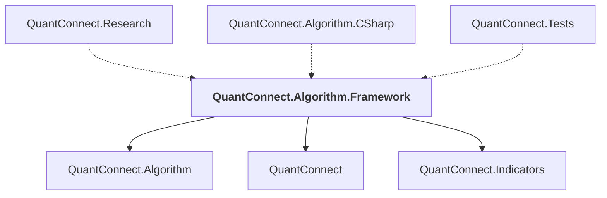

# QuantConnect.Algorithm.Framework

## Overview

| Property | Value |
|----------|-------|
| Category | Library |
| Repository | Lean |
| Path | `Algorithm.Framework/QuantConnect.Algorithm.Framework.csproj` |
| Project References | 3 |
| NuGet Dependencies | 6 |
| Consumers | 3 |

## Dependency Diagram

## Project References
- QuantConnect.Algorithm
- QuantConnect
- QuantConnect.Indicators

## Consumed By
- QuantConnect.Research
- QuantConnect.Algorithm.CSharp
- QuantConnect.Tests

## External NuGet Packages
| Package | Version |
|---------|---------||
| QuantConnect.pythonnet | 2.0.52 |
| Accord | 3.6.0 |
| Accord.Math | 3.6.0 |
| Accord.Statistics | 3.6.0 |
| MathNet.Numerics | 5.0.0 |
| NodaTime | 3.0.5 |

---

*[Back to Index](../index.md)*
