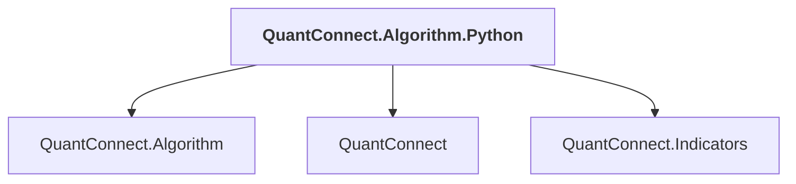

# QuantConnect.Algorithm.Python

## Overview

| Property | Value |
|----------|-------|
| Category | Library |
| Repository | Lean |
| Path | `Algorithm.Python/QuantConnect.Algorithm.Python.csproj` |
| Project References | 3 |
| NuGet Dependencies | 1 |
| Consumers | 0 |

## Dependency Diagram

## Project References
- QuantConnect.Algorithm
- QuantConnect
- QuantConnect.Indicators

## External NuGet Packages
| Package | Version |
|---------|---------||
| QuantConnect.pythonnet | 2.0.52 |

---

*[Back to Index](../index.md)*
