# QuantConnect.Algorithm

## Overview

| Property | Value |
|----------|-------|
| Category | Library |
| Repository | Lean |
| Path | `Algorithm/QuantConnect.Algorithm.csproj` |
| Project References | 4 |
| NuGet Dependencies | 4 |
| Consumers | 9 |

## Dependency Diagram

```mermaid
graph TD
    QuantConnect_Algorithm["<strong>QuantConnect.Algorithm</strong>"]
    QuantConnect_Configuration["QuantConnect.Configuration"]
    QuantConnect_Algorithm --> QuantConnect_Configuration
    QuantConnect_Indicators["QuantConnect.Indicators"]
    QuantConnect_Algorithm --> QuantConnect_Indicators
    QuantConnect["QuantConnect"]
    QuantConnect_Algorithm --> QuantConnect
    QuantConnect_Logging["QuantConnect.Logging"]
    QuantConnect_Algorithm --> QuantConnect_Logging
    QuantConnect_Research["QuantConnect.Research"]
    QuantConnect_Research -.-> QuantConnect_Algorithm
    QuantConnect_Algorithm_CSharp["QuantConnect.Algorithm.CSharp"]
    QuantConnect_Algorithm_CSharp -.-> QuantConnect_Algorithm
    QuantConnect_Algorithm_Framework["QuantConnect.Algorithm.Framework"]
    QuantConnect_Algorithm_Framework -.-> QuantConnect_Algorithm
    QuantConnect_Lean_Engine["QuantConnect.Lean.Engine"]
    QuantConnect_Lean_Engine -.-> QuantConnect_Algorithm
    QuantConnect_AlgorithmFactory["QuantConnect.AlgorithmFactory"]
    QuantConnect_AlgorithmFactory -.-> QuantConnect_Algorithm
    QuantConnect_Tests["QuantConnect.Tests"]
    QuantConnect_Tests -.-> QuantConnect_Algorithm
    QuantConnect_Algorithm_Python["QuantConnect.Algorithm.Python"]
    QuantConnect_Algorithm_Python -.-> QuantConnect_Algorithm
    QuantConnect_Lean_Launcher["QuantConnect.Lean.Launcher"]
    QuantConnect_Lean_Launcher -.-> QuantConnect_Algorithm
    QuantConnect_Report["QuantConnect.Report"]
    QuantConnect_Report -.-> QuantConnect_Algorithm
```

## Project References
- QuantConnect.Configuration
- QuantConnect.Indicators
- QuantConnect
- QuantConnect.Logging

## Consumed By
- QuantConnect.Research
- QuantConnect.Algorithm.CSharp
- QuantConnect.Algorithm.Framework
- QuantConnect.Lean.Engine
- QuantConnect.AlgorithmFactory
- QuantConnect.Tests
- QuantConnect.Algorithm.Python
- QuantConnect.Lean.Launcher
- QuantConnect.Report

## External NuGet Packages
| Package | Version |
|---------|---------||
| QuantConnect.pythonnet | 2.0.52 |
| MathNet.Numerics | 5.0.0 |
| Newtonsoft.Json | 13.0.2 |
| NodaTime | 3.0.5 |

---

*[Back to Index](../index.md)*
