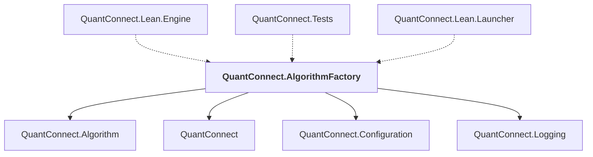

# QuantConnect.AlgorithmFactory

## Overview

| Property | Value |
|----------|-------|
| Category | Library |
| Repository | Lean |
| Path | `AlgorithmFactory/QuantConnect.AlgorithmFactory.csproj` |
| Project References | 4 |
| NuGet Dependencies | 2 |
| Consumers | 3 |

## Dependency Diagram

## Project References
- QuantConnect.Algorithm
- QuantConnect
- QuantConnect.Configuration
- QuantConnect.Logging

## Consumed By
- QuantConnect.Lean.Engine
- QuantConnect.Tests
- QuantConnect.Lean.Launcher

## External NuGet Packages
| Package | Version |
|---------|---------||
| QuantConnect.pythonnet | 2.0.52 |
| NodaTime | 3.0.5 |

---

*[Back to Index](../index.md)*
