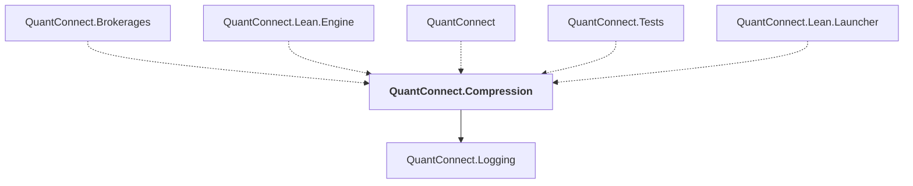

# QuantConnect.Compression

## Overview

| Property | Value |
|----------|-------|
| Category | Library |
| Repository | Lean |
| Path | `Compression/QuantConnect.Compression.csproj` |
| Project References | 1 |
| NuGet Dependencies | 2 |
| Consumers | 5 |

## Dependency Diagram

## Project References
- QuantConnect.Logging

## Consumed By
- QuantConnect.Brokerages
- QuantConnect.Lean.Engine
- QuantConnect
- QuantConnect.Tests
- QuantConnect.Lean.Launcher

## External NuGet Packages
| Package | Version |
|---------|---------||
| DotNetZip | 1.16.0 |
| SharpZipLib | 1.3.3 |

---

*[Back to Index](../index.md)*
