# QuantConnect.Configuration

## Overview

| Property | Value |
|----------|-------|
| Category | Library |
| Repository | Lean |
| Path | `Configuration/QuantConnect.Configuration.csproj` |
| Project References | 1 |
| NuGet Dependencies | 2 |
| Consumers | 15 |

## Dependency Diagram

```mermaid
graph TD
    QuantConnect_Configuration["<strong>QuantConnect.Configuration</strong>"]
    QuantConnect_Logging["QuantConnect.Logging"]
    QuantConnect_Configuration --> QuantConnect_Logging
    QuantConnect_Api["QuantConnect.Api"]
    QuantConnect_Api -.-> QuantConnect_Configuration
    QuantConnect_Optimizer_Launcher["QuantConnect.Optimizer.Launcher"]
    QuantConnect_Optimizer_Launcher -.-> QuantConnect_Configuration
    QuantConnect_Messaging["QuantConnect.Messaging"]
    QuantConnect_Messaging -.-> QuantConnect_Configuration
    QuantConnect_Research["QuantConnect.Research"]
    QuantConnect_Research -.-> QuantConnect_Configuration
    QuantConnect_Brokerages["QuantConnect.Brokerages"]
    QuantConnect_Brokerages -.-> QuantConnect_Configuration
    QuantConnect_DownloaderDataProvider_Launcher["QuantConnect.DownloaderDataProvider.Launcher"]
    QuantConnect_DownloaderDataProvider_Launcher -.-> QuantConnect_Configuration
    QuantConnect_Lean_Engine["QuantConnect.Lean.Engine"]
    QuantConnect_Lean_Engine -.-> QuantConnect_Configuration
    QuantConnect_Queues["QuantConnect.Queues"]
    QuantConnect_Queues -.-> QuantConnect_Configuration
    QuantConnect_AlgorithmFactory["QuantConnect.AlgorithmFactory"]
    QuantConnect_AlgorithmFactory -.-> QuantConnect_Configuration
    QuantConnect["QuantConnect"]
    QuantConnect -.-> QuantConnect_Configuration
    QuantConnect_Tests["QuantConnect.Tests"]
    QuantConnect_Tests -.-> QuantConnect_Configuration
    QuantConnect_Optimizer["QuantConnect.Optimizer"]
    QuantConnect_Optimizer -.-> QuantConnect_Configuration
    QuantConnect_Lean_Launcher["QuantConnect.Lean.Launcher"]
    QuantConnect_Lean_Launcher -.-> QuantConnect_Configuration
    QuantConnect_Report["QuantConnect.Report"]
    QuantConnect_Report -.-> QuantConnect_Configuration
    QuantConnect_Algorithm["QuantConnect.Algorithm"]
    QuantConnect_Algorithm -.-> QuantConnect_Configuration
```

## Project References
- QuantConnect.Logging

## Consumed By
- QuantConnect.Api
- QuantConnect.Optimizer.Launcher
- QuantConnect.Messaging
- QuantConnect.Research
- QuantConnect.Brokerages
- QuantConnect.DownloaderDataProvider.Launcher
- QuantConnect.Lean.Engine
- QuantConnect.Queues
- QuantConnect.AlgorithmFactory
- QuantConnect
- QuantConnect.Tests
- QuantConnect.Optimizer
- QuantConnect.Lean.Launcher
- QuantConnect.Report
- QuantConnect.Algorithm

## External NuGet Packages
| Package | Version |
|---------|---------||
| McMaster.Extensions.CommandLineUtils | 2.6.0 |
| Newtonsoft.Json | 13.0.2 |

---

*[Back to Index](../index.md)*
