# QuantConnect.Indicators

## Overview

| Property | Value |
|----------|-------|
| Category | Library |
| Repository | Lean |
| Path | `Indicators/QuantConnect.Indicators.csproj` |
| Project References | 2 |
| NuGet Dependencies | 2 |
| Consumers | 8 |

## Dependency Diagram

```mermaid
graph TD
    QuantConnect_Indicators["<strong>QuantConnect.Indicators</strong>"]
    QuantConnect["QuantConnect"]
    QuantConnect_Indicators --> QuantConnect
    QuantConnect_Logging["QuantConnect.Logging"]
    QuantConnect_Indicators --> QuantConnect_Logging
    QuantConnect_Research["QuantConnect.Research"]
    QuantConnect_Research -.-> QuantConnect_Indicators
    QuantConnect_Algorithm_CSharp["QuantConnect.Algorithm.CSharp"]
    QuantConnect_Algorithm_CSharp -.-> QuantConnect_Indicators
    QuantConnect_Algorithm_Framework["QuantConnect.Algorithm.Framework"]
    QuantConnect_Algorithm_Framework -.-> QuantConnect_Indicators
    QuantConnect_Lean_Engine["QuantConnect.Lean.Engine"]
    QuantConnect_Lean_Engine -.-> QuantConnect_Indicators
    QuantConnect_Tests["QuantConnect.Tests"]
    QuantConnect_Tests -.-> QuantConnect_Indicators
    QuantConnect_Algorithm_Python["QuantConnect.Algorithm.Python"]
    QuantConnect_Algorithm_Python -.-> QuantConnect_Indicators
    QuantConnect_Lean_Launcher["QuantConnect.Lean.Launcher"]
    QuantConnect_Lean_Launcher -.-> QuantConnect_Indicators
    QuantConnect_Algorithm["QuantConnect.Algorithm"]
    QuantConnect_Algorithm -.-> QuantConnect_Indicators
```

## Project References
- QuantConnect
- QuantConnect.Logging

## Consumed By
- QuantConnect.Research
- QuantConnect.Algorithm.CSharp
- QuantConnect.Algorithm.Framework
- QuantConnect.Lean.Engine
- QuantConnect.Tests
- QuantConnect.Algorithm.Python
- QuantConnect.Lean.Launcher
- QuantConnect.Algorithm

## External NuGet Packages
| Package | Version |
|---------|---------||
| QuantConnect.pythonnet | 2.0.52 |
| MathNet.Numerics | 5.0.0 |

---

*[Back to Index](../index.md)*
