# QuantConnect.Lean.Engine

## Overview

| Property | Value |
|----------|-------|
| Category | Library |
| Repository | Lean |
| Path | `Engine/QuantConnect.Lean.Engine.csproj` |
| Project References | 10 |
| NuGet Dependencies | 5 |
| Consumers | 6 |

## Dependency Diagram

```mermaid
graph TD
    QuantConnect_Lean_Engine["<strong>QuantConnect.Lean.Engine</strong>"]
    QuantConnect_Algorithm_CSharp["QuantConnect.Algorithm.CSharp"]
    QuantConnect_Lean_Engine --> QuantConnect_Algorithm_CSharp
    QuantConnect_AlgorithmFactory["QuantConnect.AlgorithmFactory"]
    QuantConnect_Lean_Engine --> QuantConnect_AlgorithmFactory
    QuantConnect_Algorithm["QuantConnect.Algorithm"]
    QuantConnect_Lean_Engine --> QuantConnect_Algorithm
    QuantConnect_Api["QuantConnect.Api"]
    QuantConnect_Lean_Engine --> QuantConnect_Api
    QuantConnect_Brokerages["QuantConnect.Brokerages"]
    QuantConnect_Lean_Engine --> QuantConnect_Brokerages
    QuantConnect_Compression["QuantConnect.Compression"]
    QuantConnect_Lean_Engine --> QuantConnect_Compression
    QuantConnect_Configuration["QuantConnect.Configuration"]
    QuantConnect_Lean_Engine --> QuantConnect_Configuration
    QuantConnect_Indicators["QuantConnect.Indicators"]
    QuantConnect_Lean_Engine --> QuantConnect_Indicators
    QuantConnect["QuantConnect"]
    QuantConnect_Lean_Engine --> QuantConnect
    QuantConnect_Logging["QuantConnect.Logging"]
    QuantConnect_Lean_Engine --> QuantConnect_Logging
    QuantConnect_Research["QuantConnect.Research"]
    QuantConnect_Research -.-> QuantConnect_Lean_Engine
    QuantConnect_DownloaderDataProvider_Launcher["QuantConnect.DownloaderDataProvider.Launcher"]
    QuantConnect_DownloaderDataProvider_Launcher -.-> QuantConnect_Lean_Engine
    QuantConnect_ToolBox["QuantConnect.ToolBox"]
    QuantConnect_ToolBox -.-> QuantConnect_Lean_Engine
    QuantConnect_Tests["QuantConnect.Tests"]
    QuantConnect_Tests -.-> QuantConnect_Lean_Engine
    QuantConnect_Lean_Launcher["QuantConnect.Lean.Launcher"]
    QuantConnect_Lean_Launcher -.-> QuantConnect_Lean_Engine
    QuantConnect_Report["QuantConnect.Report"]
    QuantConnect_Report -.-> QuantConnect_Lean_Engine
```

## Project References
- QuantConnect.Algorithm.CSharp
- QuantConnect.AlgorithmFactory
- QuantConnect.Algorithm
- QuantConnect.Api
- QuantConnect.Brokerages
- QuantConnect.Compression
- QuantConnect.Configuration
- QuantConnect.Indicators
- QuantConnect
- QuantConnect.Logging

## Consumed By
- QuantConnect.Research
- QuantConnect.DownloaderDataProvider.Launcher
- QuantConnect.ToolBox
- QuantConnect.Tests
- QuantConnect.Lean.Launcher
- QuantConnect.Report

## External NuGet Packages
| Package | Version |
|---------|---------||
| QuantConnect.pythonnet | 2.0.52 |
| fasterflect | 3.0.0 |
| MathNet.Numerics | 5.0.0 |
| Newtonsoft.Json | 13.0.2 |
| NodaTime | 3.0.5 |

---

*[Back to Index](../index.md)*
