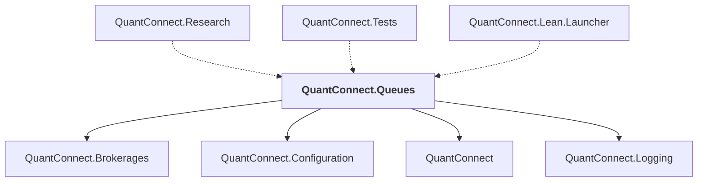

# QuantConnect.Queues

## Overview

| Property | Value |
|----------|-------|
| Category | Library |
| Repository | Lean |
| Path | `Queues/QuantConnect.Queues.csproj` |
| Project References | 4 |
| NuGet Dependencies | 1 |
| Consumers | 3 |

## Dependency Diagram

## Project References
- QuantConnect.Brokerages
- QuantConnect.Configuration
- QuantConnect
- QuantConnect.Logging

## Consumed By
- QuantConnect.Research
- QuantConnect.Tests
- QuantConnect.Lean.Launcher

## External NuGet Packages
| Package | Version |
|---------|---------||
| Newtonsoft.Json | 13.0.2 |

---

*[Back to Index](../index.md)*
