# QuantConnect.Research

## Overview

| Property | Value |
|----------|-------|
| Category | Library |
| Repository | Lean |
| Path | `Research/QuantConnect.Research.csproj` |
| Project References | 9 |
| NuGet Dependencies | 5 |
| Consumers | 2 |

## Dependency Diagram

```mermaid
graph TD
    QuantConnect_Research["<strong>QuantConnect.Research</strong>"]
    QuantConnect_Algorithm_Framework["QuantConnect.Algorithm.Framework"]
    QuantConnect_Research --> QuantConnect_Algorithm_Framework
    QuantConnect_Algorithm["QuantConnect.Algorithm"]
    QuantConnect_Research --> QuantConnect_Algorithm
    QuantConnect_Api["QuantConnect.Api"]
    QuantConnect_Research --> QuantConnect_Api
    QuantConnect["QuantConnect"]
    QuantConnect_Research --> QuantConnect
    QuantConnect_Configuration["QuantConnect.Configuration"]
    QuantConnect_Research --> QuantConnect_Configuration
    QuantConnect_Lean_Engine["QuantConnect.Lean.Engine"]
    QuantConnect_Research --> QuantConnect_Lean_Engine
    QuantConnect_Indicators["QuantConnect.Indicators"]
    QuantConnect_Research --> QuantConnect_Indicators
    QuantConnect_Logging["QuantConnect.Logging"]
    QuantConnect_Research --> QuantConnect_Logging
    QuantConnect_Queues["QuantConnect.Queues"]
    QuantConnect_Research --> QuantConnect_Queues
    QuantConnect_Tests["QuantConnect.Tests"]
    QuantConnect_Tests -.-> QuantConnect_Research
    QuantConnect_Lean_Launcher["QuantConnect.Lean.Launcher"]
    QuantConnect_Lean_Launcher -.-> QuantConnect_Research
```

## Project References
- QuantConnect.Algorithm.Framework
- QuantConnect.Algorithm
- QuantConnect.Api
- QuantConnect
- QuantConnect.Configuration
- QuantConnect.Lean.Engine
- QuantConnect.Indicators
- QuantConnect.Logging
- QuantConnect.Queues

## Consumed By
- QuantConnect.Tests
- QuantConnect.Lean.Launcher

## External NuGet Packages
| Package | Version |
|---------|---------||
| Plotly.NET | 5.1.0 |
| Plotly.NET.CSharp | 0.13.0 |
| Plotly.NET.Interactive | 5.0.0 |
| QuantConnect.pythonnet | 2.0.52 |
| NodaTime | 3.0.5 |

---

*[Back to Index](../index.md)*
