# QuantConnect

## Overview

| Property | Value |
|----------|-------|
| Category | Library |
| Repository | Lean |
| Path | `Common/QuantConnect.csproj` |
| Project References | 3 |
| NuGet Dependencies | 9 |
| Consumers | 18 |

## Dependency Diagram

```mermaid
graph TD
    QuantConnect["<strong>QuantConnect</strong>"]
    QuantConnect_Compression["QuantConnect.Compression"]
    QuantConnect --> QuantConnect_Compression
    QuantConnect_Configuration["QuantConnect.Configuration"]
    QuantConnect --> QuantConnect_Configuration
    QuantConnect_Logging["QuantConnect.Logging"]
    QuantConnect --> QuantConnect_Logging
    QuantConnect_Api["QuantConnect.Api"]
    QuantConnect_Api -.-> QuantConnect
    QuantConnect_Optimizer_Launcher["QuantConnect.Optimizer.Launcher"]
    QuantConnect_Optimizer_Launcher -.-> QuantConnect
    QuantConnect_Messaging["QuantConnect.Messaging"]
    QuantConnect_Messaging -.-> QuantConnect
    QuantConnect_Research["QuantConnect.Research"]
    QuantConnect_Research -.-> QuantConnect
    QuantConnect_Brokerages["QuantConnect.Brokerages"]
    QuantConnect_Brokerages -.-> QuantConnect
    QuantConnect_DownloaderDataProvider_Launcher["QuantConnect.DownloaderDataProvider.Launcher"]
    QuantConnect_DownloaderDataProvider_Launcher -.-> QuantConnect
    QuantConnect_Algorithm_CSharp["QuantConnect.Algorithm.CSharp"]
    QuantConnect_Algorithm_CSharp -.-> QuantConnect
    QuantConnect_Algorithm_Framework["QuantConnect.Algorithm.Framework"]
    QuantConnect_Algorithm_Framework -.-> QuantConnect
    QuantConnect_Lean_Engine["QuantConnect.Lean.Engine"]
    QuantConnect_Lean_Engine -.-> QuantConnect
    QuantConnect_Queues["QuantConnect.Queues"]
    QuantConnect_Queues -.-> QuantConnect
    QuantConnect_AlgorithmFactory["QuantConnect.AlgorithmFactory"]
    QuantConnect_AlgorithmFactory -.-> QuantConnect
    QuantConnect_Tests["QuantConnect.Tests"]
    QuantConnect_Tests -.-> QuantConnect
    QuantConnect_Indicators["QuantConnect.Indicators"]
    QuantConnect_Indicators -.-> QuantConnect
    QuantConnect_Optimizer["QuantConnect.Optimizer"]
    QuantConnect_Optimizer -.-> QuantConnect
    QuantConnect_Algorithm_Python["QuantConnect.Algorithm.Python"]
    QuantConnect_Algorithm_Python -.-> QuantConnect
    more_consumers["... +3 more"]
    more_consumers -.-> QuantConnect
```

## Project References
- QuantConnect.Compression
- QuantConnect.Configuration
- QuantConnect.Logging

## Consumed By
- QuantConnect.Api
- QuantConnect.Optimizer.Launcher
- QuantConnect.Messaging
- QuantConnect.Research
- QuantConnect.Brokerages
- QuantConnect.DownloaderDataProvider.Launcher
- QuantConnect.Algorithm.CSharp
- QuantConnect.Algorithm.Framework
- QuantConnect.Lean.Engine
- QuantConnect.Queues
- QuantConnect.AlgorithmFactory
- QuantConnect.Tests
- QuantConnect.Indicators
- QuantConnect.Optimizer
- QuantConnect.Algorithm.Python
- QuantConnect.Lean.Launcher
- QuantConnect.Report
- QuantConnect.Algorithm

## External NuGet Packages
| Package | Version |
|---------|---------||
| QuantConnect.pythonnet | 2.0.52 |
| CloneExtensions | 1.3.0 |
| fasterflect | 3.0.0 |
| MathNet.Numerics | 5.0.0 |
| Microsoft.IO.RecyclableMemoryStream | 3.0.1 |
| Newtonsoft.Json | 13.0.2 |
| NodaTime | 3.0.5 |
| protobuf-net | 3.1.33 |
| QLNet | 1.13.1 |

---

*[Back to Index](../index.md)*
