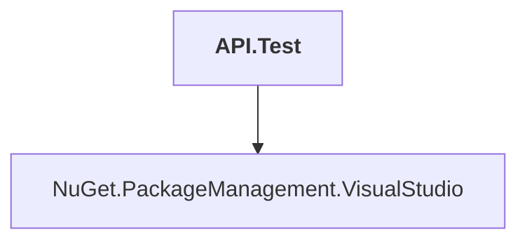

# API.Test

## Overview

| Property | Value |
|----------|-------|
| Category | Test |
| Repository | NuGet.Client |
| Path | `test/TestExtensions/API.Test/API.Test.csproj` |
| Project References | 1 |
| NuGet Dependencies | 1 |
| Consumers | 0 |

## Dependency Diagram

## Project References
- NuGet.PackageManagement.VisualStudio

## External NuGet Packages
| Package | Version |
|---------|---------||
| Microsoft.PowerShell.3.ReferenceAssemblies |  |

---

*[Back to Index](../index.md)*
