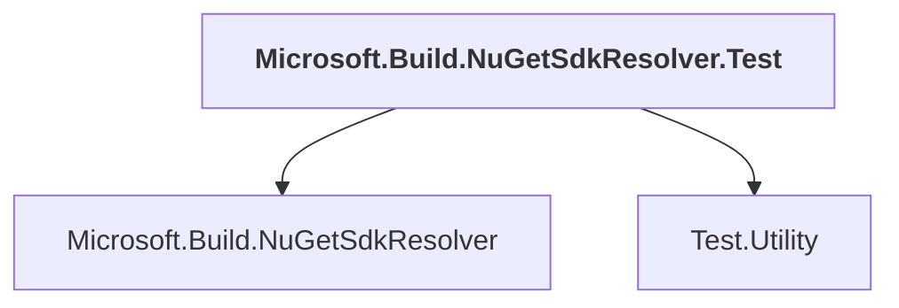

# Microsoft.Build.NuGetSdkResolver.Test

## Overview

| Property | Value |
|----------|-------|
| Category | Test |
| Repository | NuGet.Client |
| Path | `test/NuGet.Core.Tests/Microsoft.Build.NuGetSdkResolver.Test/Microsoft.Build.NuGetSdkResolver.Test.csproj` |
| Project References | 2 |
| NuGet Dependencies | 1 |
| Consumers | 0 |

## Dependency Diagram

## Project References
- Microsoft.Build.NuGetSdkResolver
- Test.Utility

## External NuGet Packages
| Package | Version |
|---------|---------||
| Microsoft.Build.Framework |  |

---

*[Back to Index](../index.md)*
