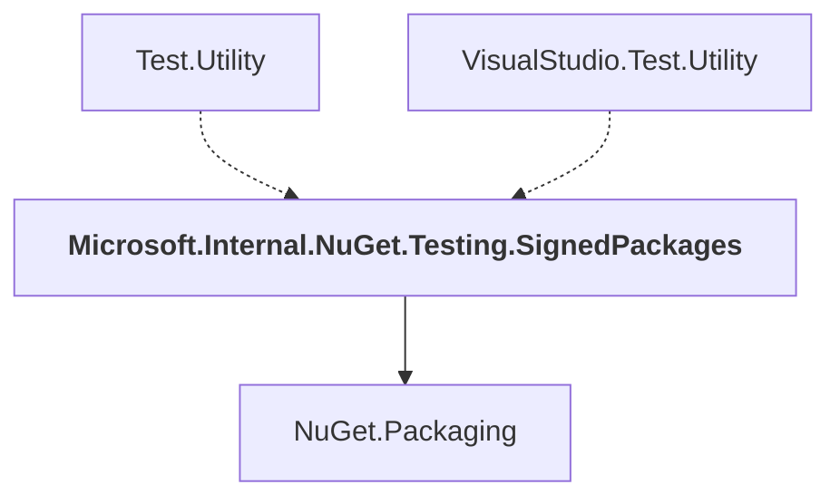

# Microsoft.Internal.NuGet.Testing.SignedPackages

## Overview

| Property | Value |
|----------|-------|
| Category | Test |
| Repository | NuGet.Client |
| Path | `test/TestUtilities/Microsoft.Internal.NuGet.Testing.SignedPackages/Microsoft.Internal.NuGet.Testing.SignedPackages.csproj` |
| Project References | 1 |
| NuGet Dependencies | 2 |
| Consumers | 2 |

## Dependency Diagram

## Project References
- NuGet.Packaging

## Consumed By
- Test.Utility
- VisualStudio.Test.Utility

## External NuGet Packages
| Package | Version |
|---------|---------||
| System.Formats.Asn1 |  |
| xunit |  |

---

*[Back to Index](../index.md)*
