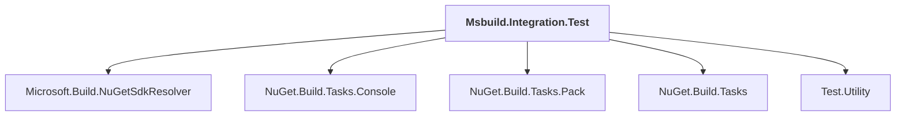

# Msbuild.Integration.Test

## Overview

| Property | Value |
|----------|-------|
| Category | Test |
| Repository | NuGet.Client |
| Path | `test/NuGet.Core.FuncTests/Msbuild.Integration.Test/Msbuild.Integration.Test.csproj` |
| Project References | 5 |
| NuGet Dependencies | 0 |
| Consumers | 0 |

## Dependency Diagram

## Project References
- Microsoft.Build.NuGetSdkResolver
- NuGet.Build.Tasks.Console
- NuGet.Build.Tasks.Pack
- NuGet.Build.Tasks
- Test.Utility

---

*[Back to Index](../index.md)*
