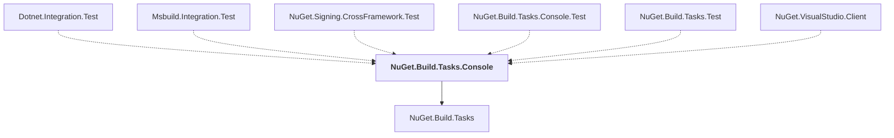

# NuGet.Build.Tasks.Console

## Overview

| Property | Value |
|----------|-------|
| Category | Tool |
| Repository | NuGet.Client |
| Path | `src/NuGet.Core/NuGet.Build.Tasks.Console/NuGet.Build.Tasks.Console.csproj` |
| Project References | 1 |
| NuGet Dependencies | 4 |
| Consumers | 6 |

## Dependency Diagram

## Project References
- NuGet.Build.Tasks

## Consumed By
- Dotnet.Integration.Test
- Msbuild.Integration.Test
- NuGet.Signing.CrossFramework.Test
- NuGet.Build.Tasks.Console.Test
- NuGet.Build.Tasks.Test
- NuGet.VisualStudio.Client

## External NuGet Packages
| Package | Version |
|---------|---------||
| Microsoft.Build.Framework |  |
| Microsoft.Build |  |
| Microsoft.Build.Tasks.Core |  |
| Microsoft.Build.Utilities.Core |  |

---

*[Back to Index](../index.md)*
